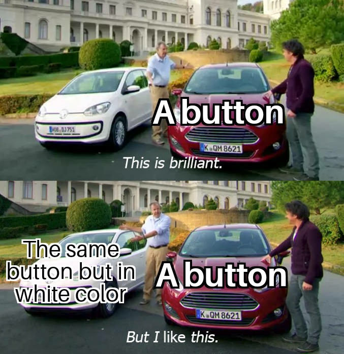
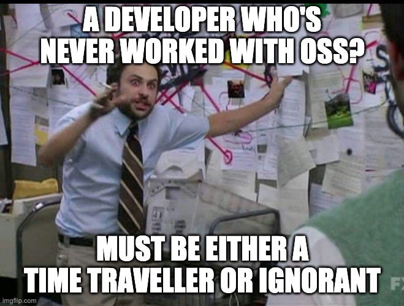

Project management is a wild way to make sure things are progressing as they should. There is a project management technique for everything. Well, almost everything. I haven't found a project managing concept to overcome my feelings of procrastination. Someone might create it one day.

## What really _is_ Open Source?

If you're the engineering type of person that tackles humanity's problems and urgent needs by bringing together an entire community and building a "project" with them, you'll want to know about **Open source**. Open source refers to a philosophy of software development that emphasizes collaboration, transparency, and community-driven innovation. 

Here it is again in bigger letters, for impact:

> ### Open source refers to a philosophy of software development that emphasizes collaboration, transparency, and community-driven innovation.

And now you know what open source is. _In theory, this blog post could be done!_

---

### Beyond the marketing standpoint

Technology is a concept which is ever-changing in how it is defined, its magnitude and how we as engineers develop it. In the world of technology we always find "buzz words" which reflect the recent advancements which are so efficient that they are slowly brought within the industry as a standard way of working on projects, as a team.

One such "buzz word" in the area of software development and project management is open source. Open source is a way of working on a software typically developed in a public, collaborative manner, with the source code made freely available to anyone who wants to use, modify, or distribute it. The term "open source" was coined in 1998 by a group of people in the software industry who wanted to create a new model of software development that was more collaborative and community-driven.

Open source software is often developed and maintained by a community of volunteers and contributors, who work together to improve the software and fix bugs. Consider your **homework**: a dry document which contains things here and there which you know is very incomplete. If you have a good enough personality _(which I don't)_, you send this document to all your classmates who start doing bits of your homework.

_The result?_ A fine specimen of a document which the entire class can show to your teachers for great marks! What you just did here was open sourcing your homework and let your student community work on it to create a more appealing document which is now complete.

### But open source doesn't stop there

Imagine your homework to be your project, your classmates to be your community. This community observes your project and suggests various improvements within it. Be it suggesting simple changes of changing the fonts or re-working the already existing complex APIs and queries.

|  |
|:--:|
| *A simple conversation between a contributor and a project developer* |

Another way to look at open source can be building the big **Lego City** together, block by block. Everyone can add their own pieces to what has been constructed so far and everyone can see how the city is made. In this way, everyone can make the city better and use it how they want.

|  |
|:--:|
| *Budding software engineers collaborating to build their project* |

Open source is a great way to bring like-minded developers together. Everybody around you, be a fresher student or an industry experienced individual, has had to encounter with open source technologies without even realizing it. From something we daily use like **Android** to **Linux**: the operating system used by many corporates and tech giants, there's no saying what the next big thing will be.

|  |
|:--:|
| *Python, Dart, React, MongoDB, even this text box is open source* |

That's about the gist of what I wished to express regarding open source. Surely that's not everything but I do look forward to go in-depth into this topic and talk about various different things which excite me! Do look forward to upcoming blogposts and reach me out for any constructive criticism, if any, for the future blogposts.