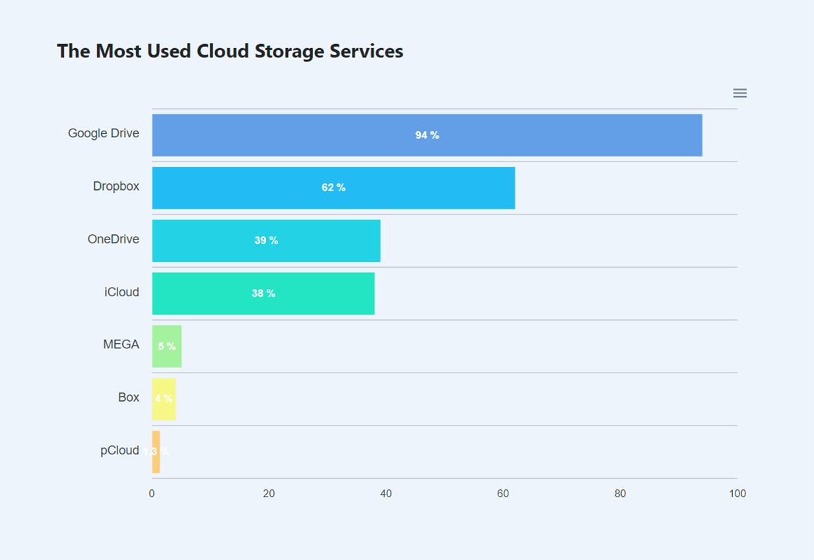
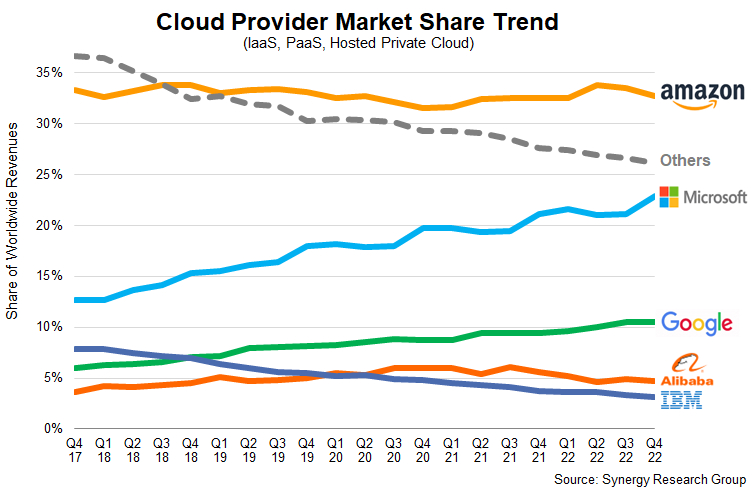
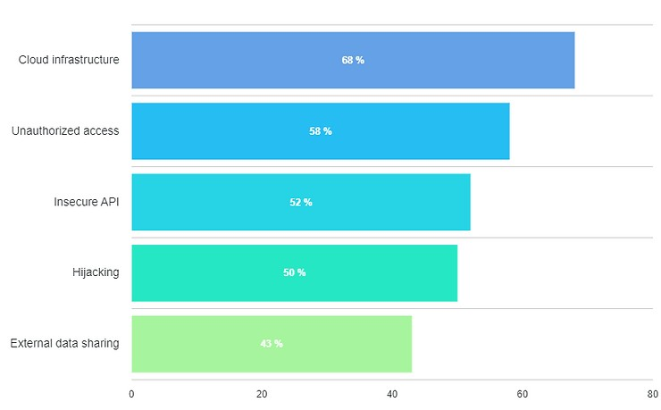

> This Blog talks about the emerging trends in Cloud computing, and also gives a gist about the term Cloud Computing and its impact in leveraging businesses and individuals. The cloud has the ability to streamline and improve a variety of processes. From understanding the meaning of cloud computing model to discussing various characteristics, this blog will be your one-stop-shop for all things cloud computing. So, fasten your seatbelts and let's dive into the exciting world of the cloud together!!

 

# What is Cloud Computing ?  

Cloud computing is a way of using current technology where we can access and use internet-based services and storage to manage, process, and store data and information, instead of having to have it all on your own personal device or computer. 

We can think of it like having access to a giant computer in the sky that we can use to do our work, store our files, and run our applications, without having to worry about the technical details or maintenance of the underlying hardware and software. This makes it easier and more convenient for us to access our data and resources from anywhere in the world, as long as we have an internet connection.

## Let's take a look at some intriguing features of Cloud Computing!!
 

<b>🛠️ On-Demand Self-Service</b>

With cloud computing, we can provision computing services, like server time and network storage, automatically. No communication with the service provider will be necessary. Customers of cloud services can view their cloud services, track their usage, and provision and de-provision services by logging into their cloud accounts through a web self-service portal.

<b>💻 Broad Network Access</b>

Broad network connectivity is another crucial aspect of cloud computing. Through a network and on portable devices like smartphones, tablets, laptops, and desktop PCs, we can access cloud services. A private cloud employs a local area network, whereas a public cloud uses the internet. Broad network access and cloud computing both rely heavily on latency and bandwidth since they have an impact on service quality.

<b>📝 Resource Pooling</b>

With resource pooling, multiple customers can share physical resources using a multi-tenant model. Based on demand, this model distributes and redistributes real and virtual resources. Customers can share the same applications or infrastructure with multi-tenancy while still retaining their privacy and security. Customers may be able to designate the location of their resources at a higher level of abstraction, such as a country, state, or data centre, even though they won't know the precise location of their resources. Customers can pool a variety of resources, including memory, computing power, and bandwidth.

<b>🔗 Rapid Elasticity</b>

Cloud services can be elastically provisioned and released, sometimes automatically, so customers can scale quickly based on demand, thus making it highly scalable. The capabilities available for provisioning are practically unlimited. Customers can use these features whenever they want and in whatever amount. Customers can scale cloud capacity, cost, and usage without incurring additional contracts or charges. We won't need to acquire computer hardware thanks to quick elasticity. 

<b>⚙️ Measured Service</b>

A metering capability in cloud systems optimises resource utilisation at an abstraction level appropriate for the type of service. For storage, processing, bandwidth, and users, for instance, we can utilise a metered service. A pay-for-what-you-use model is used to base payments on the customer's actual consumption. Consumers and service providers benefit from a transparent experience that is created by monitoring, managing, and reporting resource use.

## Lets have a look at some of the most used Cloud Storage Services
 

|  |
| :--: |
| *Most used Cloud Storage Services* |

Google Drive is by far the most popular cloud storage service in the world, with an use rate of **94.44 percent**. The finest cloud storage for collaboration, Dropbox, is in second position with a still-impressive **66.2 percent**, followed by [**OneDrive**](https://www.microsoft.com/en-in/microsoft-365/onedrive/online-cloud-storage) **(39.35 percent)** and [**iCloud**](https://www.icloud.com/) **(38.89 percent)**. Additionally popular cloud storage providers include [**MEGA**](https://mega.io/) **(5.09 percent)**, [**Box**](https://www.box.com/) **(4.17 percent)**, and [**pCloud**](https://www.pcloud.com/) **(1.39%)**, all of which made our list of the top cloud storage services.

## Statistics on Cloud Service Providers
 

|  |
| :--: |
| *Stats on Cloud Service Providers* |

AWS still holds over a third of the cloud services market:

- In Q2 2022, [**AWS**](https://aws.amazon.com/) commanded **34%** of the cloud market, a **1%** increase year-over-year. [**Azure**](https://azure.microsoft.com/en-in) is second with **21%** of the market, followed by [**Google Cloud**](https://cloud.google.com/) **(10%)**, [**Alibaba**](https://in.alibabacloud.com/en) **(5%)**, and [**IBM**](https://www.ibm.com/cloud) **(4%)**.
- Amazon's revenue from AWS grew from **5.62** in 2014 to **13.24%** in 2021.
- The survey also showed the cloud market continues to grow **34%** year-over-year.

:::tip FunFact

It took Netflix seven years to migrate to AWS

:::

## Some drawbacks to have a look upon
 

|  |
| :--: |
| *Drawbacks of Cloud Computing* |

According to cybersecurity experts, the most pressing cloud security challenges are misconfiguration of the cloud infrastructure **(68 percent)**; unauthorized access **(58 percent)**; insecure API **(52 percent)**; accounts, services or traffic hijacking **(50 percent)** and external data sharing **(43 percent)**.

:::info 

If you are interested in finding out more about cloud security, we have an [excellent article detailing cloud security measures](https://www.cloudwards.net/cloud-security/) for cloud storage services.

:::

## Conclusion

- In conclusion, cloud computing has become an increasingly popular and indispensable tool for businesses and organizations of all sizes. With its ability to provide on-demand access to a wide range of computing resources, including storage, computing power, and applications, it has transformed the way organizations operate and has unlocked new opportunities for innovation and growth.
- The cloud offers many benefits, including cost savings, scalability, increased efficiency, and improved security. As more and more businesses adopt cloud computing, it is likely that this trend will continue to grow, driving further innovation and enabling organizations to do more with less.
- However, while the benefits of cloud computing are clear, there are also challenges that must be addressed, such as ensuring data security, managing vendor lock-in, and ensuring reliable performance.
- Despite these challenges, the future of cloud computing looks bright, with advancements in areas such as artificial intelligence, machine learning, and the Internet of Things set to further drive its growth and revolutionize the way businesses operate.

In short, cloud computing is here to stay, and its impact on the business world will only continue to grow in the years to come.