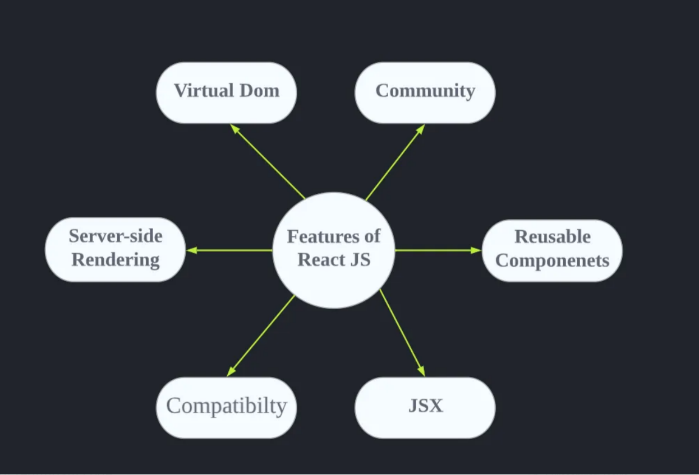
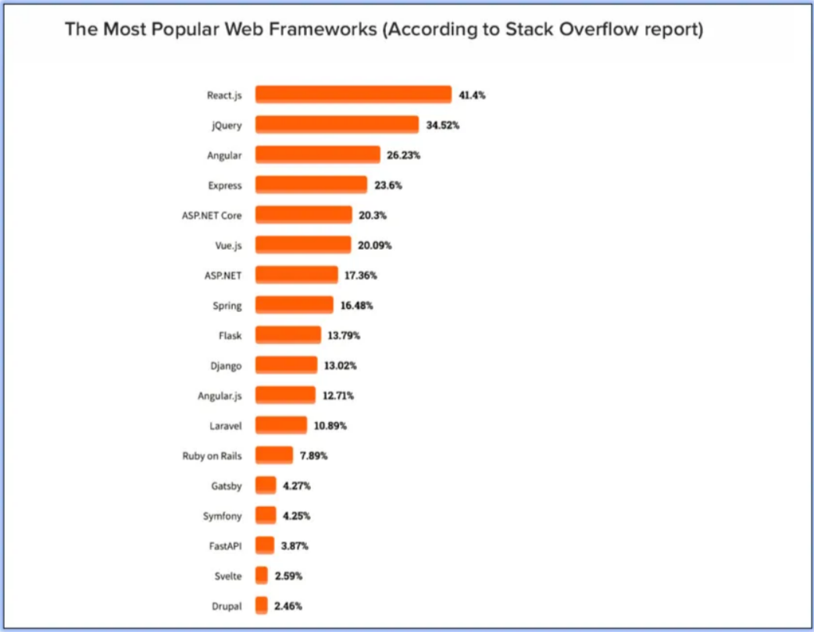

><b>As</b> technology continues to evolve, web development has become an increasingly important field, and front-end frameworks such as ReactJS have emerged as crucial tools for building dynamic, user-friendly websites. Whether you are just starting out with web development or are looking to enhance your existing skills, I hope that you will find valuable insights and tips within these pages.
So sit back, grab a cup of coffee, and join me on our journey through the exciting world of ReactJS!

<br />

|  |
| :--: |
| *“Design is not just what it looks like and feels like. Design is how it works.” — Steve Jobs* |

<br/>

# What is React JS?

React JS is nothing but a java script library that helps the developers in creating reusable UI components there by increasing the efficiency of code. When making dynamic websites React JS is proven to be more effective than Vanilla JS, and hence it has become a popular choice for building fast and scalable single-page applications. In simple terms, ReactJS helps make web development more efficient, organized, and dynamic.

# Characteristic Features of React JS that makes it more versatile and Popular

|  |
| :--: |
| *Features of ReactJS* |

## 1. Virtual DOM

In traditional web development, when changes are made to a web page, the entire page needs to be re-rendered, which can be slow and time-consuming. The Virtual DOM solves this issue by creating a virtual representation of the web page in memory so when changes are made, ReactJS updates the virtual DOM instead of the actual page, which is much faster. Then, ReactJS compares the virtual DOM to the actual page and updates only the parts that have changed, rather than the entire page. This makes the updates and rendering process much faster and more efficient, improving the overall user experience of the web application.

## 2. Reusable Components

ReactJS uses a component-based architecture, which means that the user interface is built using reusable components. Each component is a self-contained unit that handles a specific task or displays a specific piece of information, we can say that each components are independent. This makes the code more organized and easier to maintain, as well as reducing the amount of redundant code.

## 3. Community

React has a vast and supportive community of developers who are constantly contributing new features and tools. React is open-source, meaning that anyone can contribute to the development of the library by fixing bugs, adding new features, or improving existing ones.

>[*Link to contribute to the React Library*](https://github.com/facebook/react)

## 4. JSX

JSX stands for JavaScript XML. It is a syntax extension for JavaScript used by ReactJS that allows developers to write HTML-like code within their JavaScript. This makes it easier for users to write and understand the code, as it closely resembles the structure of HTML. This helps to improve the overall development experience by making the code more intuitive and easier to read.

For example, instead of writing the following code in pure JavaScript to render a simple button:

```js 
React.createElement("button", {className: "myButton"}, "Click Me!");
```

The same code can be written in JSX as:

```jsx
<button className="myButton">Click Me!</button>; 
```

## 5. Server-side Rendering

Server-side rendering (SSR) is the process of rendering a web page on the server before sending it to the browser. In the case of React, this means that the React components can be rendered on the server, allowing the browser to receive a fully rendered HTML page, instead of having to wait for JavaScript to execute and render the page on the client side again and again.

This results in faster initial load times, as the browser doesn’t have to wait for the JavaScript to execute and render the page. Additionally, server-side rendering can improve Search Engine Optimization (SEO), as search engines can better index and understand the content of the page.

## 6. Compatibility

React’s simplicity and straightforward design makes it easy for developers to learn and adopt and it works seamlessly with other libraries and frameworks, such as Redux, allowing developers to create complex and scalable web applications.

# Comaprison with other Frontend Frameworks

|  |
| :--: |
| *Comparison with other frameworks as per the recent survey* |

>Source: Stack Overflow Developer Survey 2021

From the above survey it can be clearly seen that React JS was named as one on the most commonly used web Framework.

React’s virtual DOM provides fast updates and rendering compared to traditional DOM manipulation. Angular and Vue also have optimized updates, but they may not be as fast as React’s virtual DOM.

Also, React is known for its simplicity and minimalistic approach, making it relatively easy to learn and get started with. Angular, on the other hand, has a steeper learning curve due to its more complex architecture. Vue falls somewhere in between, offering a more accessible learning experience as compared to Angular.

:::info 

You can see more detailed insights of React JS on their [**Official Website**](https://reactjs.org/)

:::

## Conclusion

In conclusion, React is the future of web development, offering a robust set of features and tools that make it easy to build high-performing, scalable, and maintainable web applications. Its simplicity, performance, and compatibility with other technologies make it an excellent choice for modern web development.


