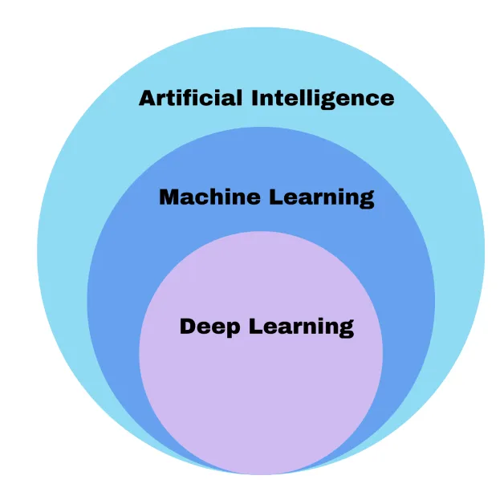

> Unlock the mystery of AI with this epic multi-part series, taking you on a journey from its humble beginnings to the present day. Join us as we explore different aspects of Artificial Intelligence in this entire series.

Artificial Intelligence (AI) is an exciting and rapidly growing field that has the potential to transform our world in countless ways. From self-driving cars to virtual personal assistants, AI has already made its way into many aspects of our daily lives, and its applications continue to expand.

Artificial Intelligence is composed of two words **Artificial** and **Intelligence**, where Artificial defines _“man-made,”_ and intelligence defines _“thinking power”_, hence AI means _“a man-made thinking power.”_

> Artificial Intelligence is a branch of computer science by which we can create intelligent machines which can behave like a human, think like humans, and able to make decisions.

But what exactly is AI, and how did it come to be? In this article, we’ll take a brief look at the history of AI and its evolution over time.

### Early Concepts of AI

The idea of machines that could mimic human intelligence dates back centuries, with early examples including the ancient Greek myths of Talos, a giant bronze statue that could move and act on its own, and Pygmalion’s statue, which was brought to life by the goddess Aphrodite.

|  |
| :--: |
| *Figure 1 — Talos by [**Adrienne Mayor**](https://technicacuriosa.com/author/amayor/)* |

In the modern era, the concept of AI began to take shape in the mid-20th century. In 1950, computer scientist Alan Turing proposed the “Turing Test,” which is still used today to measure a machine’s ability to exhibit intelligent behavior equivalent to, or indistinguishable from, that of a human.

Early AI research focused on rule-based systems, in which machines were programmed to follow a set of explicit rules to solve problems. While these systems were effective for some tasks, they were limited by their inflexibility and inability to learn from experience.

AI has many sub-categories like Machine Learning and Deep Learning. People usually tend to use these terms interchangeably. Let’s look at these terms in brief -

|  |
| :--: |
| *Figure 2 — By the [Author](https://medium.com/@nidhiworah02) — Types of Artificial Intelligence* |

## The Rise of Machine Learning

In the 1980s, a new approach to AI emerged: Machine Learning. This approach involved designing algorithms that could learn from data, identify patterns, and make predictions based on that data.

Machine learning algorithms were initially used for simple tasks such as recognizing handwritten characters, but their applications quickly expanded to more complex problems, including speech recognition, image recognition, and natural language processing.

## Deep Learning and Neural Networks

In the 2010s, a subfield of machine learning known as deep learning began to emerge, fueled by advances in computing power and data storage. Deep learning algorithms are modeled after the structure and function of the human brain, using artificial neural networks to simulate the behavior of neurons and synapses.       

Deep learning has enabled breakthroughs in areas such as image and speech recognition and has led to the development of autonomous vehicles and other advanced technologies.

## The Future of AI

As AI continues to advance, its potential applications are virtually limitless. From personalized healthcare to smart homes and cities, AI has the power to revolutionize nearly every aspect of our lives.

As Uncle Ben says, “With great power comes great responsibility.” AI systems become more sophisticated, it’s important to ensure that they are designed and deployed ethically and responsibly, with consideration for issues such as bias, privacy, and security.

## Types of Artificial Intelligence

|  |
| :--: |
| *Figure 3 — By the [Author](https://medium.com/@nidhiworah02) — Types of Artificial Intelligence* |

 

### Artificial Intelligence — Type 1: Based on Capabilities

**Narrow AI**

*   Narrow AI is a type of AI that is able to perform a dedicated task with intelligence.
*   Narrow AI cannot perform beyond its field or limitations, as it is only trained for one specific task. Hence it is also termed weak AI. Narrow AI can fail in unpredictable ways if it goes beyond its limits.
*   Some Examples of Narrow AI are playing chess, purchasing suggestions on e-commerce sites, self-driving cars, speech recognition, and image recognition.     

**General AI**

*   General AI is a type of intelligence that could perform any intellectual task with efficiency like a human.
*   The idea behind the general AI is to make such a system that could be smarter and think like a human on its own.
*   It is currently a hypothetical concept, and we don’t yet have any real-world examples of this type of AI.

**Super AI**

*   Super AI is a level of Intelligence of Systems at which machines could surpass human intelligence, and can perform any task better than humans with cognitive properties. It is an outcome of general AI.
*   Super AI is still a hypothetical concept of Artificial Intelligence. The development of such systems in real is still world changing task.

### Artificial Intelligence — Type 2: Based on Functionality

**Reactive Machines**

*   Purely reactive machines are the most basic types of Artificial Intelligence.
*   Such AI systems do not store memories or past experiences for future actions.
*   These machines only focus on current scenarios and react to them as per the possible best action.
*   Examples: IBM’s Deep Blue system, Google’s AlphaGo

**Limited Memory**

*   Limited memory machines can store past experiences or some data for a short period of time.
*   These machines can use stored data for a limited time period only.
*   Self-driving cars are one of the best examples of Limited Memory systems. These cars can store the recent speed of nearby cars, the distance of other cars, 
the speed limit, and other information to navigate the road.

**Theory Of Mind**

*   Theory of Mind AI should understand human emotions, people, and beliefs, and be able to interact socially like humans.
*   This type of AI machine is still not developed, but researchers are making lots of efforts and improvements for developing such AI machines.

**Self-Awareness**

*   Self-awareness AI is the future of Artificial Intelligence. These machines will be super intelligent and will have their own consciousness, sentiments, and 
self-awareness.
*   These machines will be smarter than the human mind.
*   Self-Awareness AI does not exist in reality still and it is a hypothetical concept.

## Conclusion

Artificial intelligence has come a long way since the early days of rule-based systems, and its evolution shows no signs of slowing down. With ongoing research 
and development, the potential applications of AI are vast and ever-expanding.

If you enjoy reading stories on similar topics then do [follow](https://medium.com/@nidhiworah02/subscribe) the account. Let me know your thoughts below  