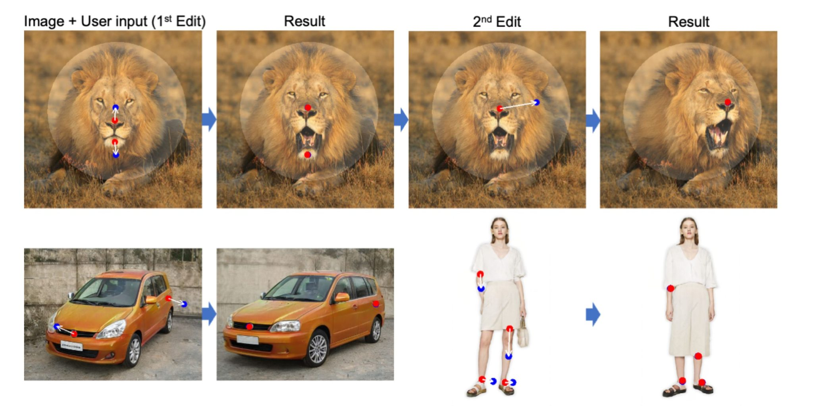
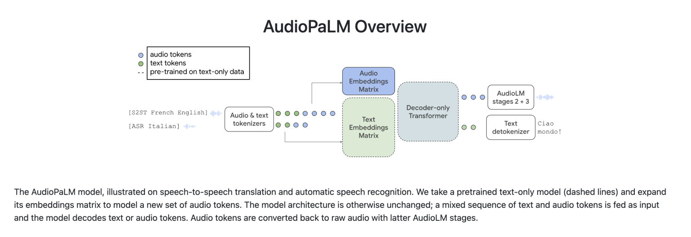

## Code Optimization Revolutionized: Google DeepMind's AI Unleashes New Speed-Boosting Technique. [^1]

DeepMind's AlphaDev AI achieves groundbreaking speed improvements in sorting algorithms, surpassing existing methods by up to 70%. Its innovative techniques have been adopted by millions of software developers, marking the first integration of AI-discovered algorithms in language updates. DeepMind's gamified approach, using reinforcement learning, trains AlphaDev to construct faster and correct algorithms. This breakthrough revolutionizes code optimization and sets the stage for further AI-driven innovations in computer science.

## Elevating the Shopping Experience with AI Virtual Try-On on Google Shopping. [^2]

Google Shopping has introduced AI Virtual Try-On, a new feature that allows users to virtually try on beauty products before buying them. Using advanced machine learning algorithms and facial recognition technology, the feature provides realistic representations of the products on the user's face. It enhances convenience, addresses concerns about online shopping, and offers a seamless experience. Users can access the feature from Google Search, Google Shopping, or participating retailer websites, making informed decisions with detailed product information and user reviews. This innovation bridges the gap between online and in-store try-ons, revolutionizing the beauty shopping experience.

## Ink AI Unveils ChatGPT-Based E-book Generator for Effortless Full-Length E-book Creation. [^3]

Ink AI has introduced a game-changing e-book generator tool that utilizes ChatGPT, an AI language model, to effortlessly create full-length e-books. By inputting prompts, users receive context-aware responses that form the basis of their e-books, making the writing process faster and more efficient. The tool allows customization of genre, style, and length, and the user-friendly interface simplifies content creation. Ink AI's e-book generator opens up new possibilities for authors, content creators, and publishers by revolutionizing the e-book creation process with AI technology.

## Meta Unveils Stablediffusion: A Groundbreaking AI Model for Music Generation. [^4]

Meta has introduced Stablediffusion, an advanced AI model called MusicGen, designed for music generation. Unlike traditional models, Stablediffusion produces stable, coherent, and emotionally engaging musical compositions. Trained on diverse musical genres, the model incorporates stability mechanisms for smooth transitions and consistent structures. 

It considers melody, harmonies, rhythms, and tonal variations, resulting in natural and professional-sounding compositions. Stablediffusion offers a powerful tool for musicians, composers, and music enthusiasts, revolutionizing AI-generated music with its stable and artistically satisfying output.

## Draggan Goes Open Source: Empowering Developers with Advanced AI Framework. [^5]

Draggan, an advanced AI framework focused on reinforcement learning, has been released as open source. This allows developers worldwide to access and utilize its capabilities for training AI models. Draggan simplifies the process with its user-friendly interface, extensive documentation, and pre-built components, enabling faster development and deployment of AI systems. By democratizing access to this powerful tool, the open-source release of Draggan promotes collaboration and accelerates advancements in AI research and application development.

## MIT Introduces New Model for Accelerated Drug Discovery. [^6]

MIT researchers have developed a groundbreaking AI model called AccelerateDrug, which revolutionizes the process of drug discovery. The model utilizes advanced machine learning algorithms to rapidly analyze chemical and biological data, predicting the effectiveness of potential drug compounds. By significantly reducing experimentation time and resources, AccelerateDrug streamlines the drug discovery process and expedites the development of new medications. 

The model has demonstrated high accuracy and outperformed existing methods in predicting drug efficacy. AccelerateDrug has the potential to accelerate the availability of life-saving treatments, benefiting patients and advancing healthcare outcomes.

## Google Introduces AudioPalm: Bridging the Gap between Text and Voice. [^7]

Google has introduced AudioPalm, an innovative technology that bridges the gap between text and voice. Using advanced AI algorithms, it converts written text into human-like speech and transcribes spoken language into written text accurately. AudioPalm enhances accessibility, user experiences, and content creation, benefiting individuals with visual impairments and those seeking a more immersive interaction. 

The technology has applications in education, entertainment, and accessibility services, and it integrates with existing Google services like Google Assistant and Google Translate. Google's AudioPalm represents a significant advancement in natural language processing, enabling seamless conversion between text and voice for enhanced user experiences.

[^1]: [https://www.deepmind.com/research/highlighted-research/alphago](https://www.deepmind.com/research/highlighted-research/alphago)

[^2]: [https://blog.google/products/shopping/ai-virtual-try-on-google-shopping/](https://blog.google/products/shopping/ai-virtual-try-on-google-shopping/)

[^3]: [https://goodereader.com/blog/e-book-news/new-chatgpt-based-e-book-generator-tool-from-ink-ai-can-create-full-length-e-books-easily](https://goodereader.com/blog/e-book-news/new-chatgpt-based-e-book-generator-tool-from-ink-ai-can-create-full-length-e-books-easily)

[^4]: [https://analyticsindiamag.com/meta-releases-stablediffusion-for-music-musicgen/](https://analyticsindiamag.com/meta-releases-stablediffusion-for-music-musicgen/)

[^5]: [https://analyticsindiamag.com/draggan-is-finally-open-source/](https://analyticsindiamag.com/draggan-is-finally-open-source/)

[^6]: [https://news.mit.edu/2023/new-model-offers-speedy-drug-discovery-0608](https://news.mit.edu/2023/new-model-offers-speedy-drug-discovery-0608)

[^7]: [https://google-research.github.io/seanet/audiopalm/examples/](https://google-research.github.io/seanet/audiopalm/examples/)