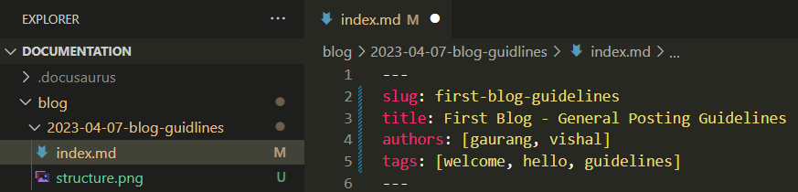

## Welcome to our first blog

Welcome everyone to TCET Open Source's Blog Section. Here, we promote blogging in the student community. Talk about ongoing trends in tech, student life at TCET, and any topic you feel would feel great for this blog.

:::note

This particular blog will have recurring adjustments. Last revised on Oct 1st, 2023.

:::

<!--truncate-->

## General Blog Guidlines

Here we define all the basic guidlines a blog should follow in TCET Open Source Blogs.

### Clone the project

For being able to contribute anywhere, one must be able to clone and run projects. You can visit this [tutorial](https://opensource.tcetmumbai.in/docs/projects/docs-site/getting-started) to learn how to work on this project.

### Basic GitHub commands

For any contributor it is very necessary to understand basic GitHub commands to begin with. There is a _resources forum_ on **TCET - Open Source Discord server** where you can find relevant references for the same. There can also be a blog post regarding these commands in the future!

### Understand file structure

Once you have cloned the project in your local storage, you will need to perform the following:

1. Open the project directory and navigate to `blog/`.
2. Create a folder for your blog post.
* The folder should have the following name format:
```sh
yyyy-mm-dd-blog-title
```
* Here, the date stands for the date when the post is supposed to be released. The blog title should be relevant to the content within the post.
3. Within the folder, create `index.mdx`. This file will serve as a text document where you can format your content which will reflect in the final post.

### Understand markdown files and syntax

Markdown is a lightweight markup language that you can use to add formatting elements to plaintext text documents. The `index.mdx` file created in your blog folder is a markdown file, similar to how _index.html_ can be an HTML file. It is very essential for a blog contributor to understand the basic syntax of markdown. _Resource forum_ in our **[Discord server](https://discord.com/invite/r7ZhAREg2M)** covers basic syntax of these files.

### First steps

Before moving any further, a blogger must know the following:

> - `slug` - It is the last part of the URL address that serves as a unique identifier of the blog post.
> - `title` - The main title of the blog post. Note that the blog title should be relevant to the content within the post.
> - `authors` - The list of authors who have worked on the blog post. Look below to understand how to add authors.
> - `tags` - It highlights the key words of the post to boost it's visibility on the internet and improve the SEO.

These four information are necessary to be present in every post. Without these, no posts will be approved and merged within the blog.


:::info Mention Authors

Authors can be added in two ways.
- Internally in `index.mdx` (recommended, for outside organization contributors)
- In the `authors.yml` file. (**TCET Open Source Members only**)

If you are not a member of the organization, you can simply append your author(s) in the following way:

```mdx
authors:
  - name: Name of Author 1
    title: Designation, Post or About
    url: https://github.com/author1
    image_url: https://github.com/author1.png
  - name: Name of Author 2
    title: Designation, Post or About
    url: https://github.com/author1
    image_url: https://github.com/author2.png
```
#### Important things to take note of:
- `url:` can also be an authors' personal website or portfolio.
- `image_url:` requires a user to have a profile pic on their Github Account. We recommend to append a Github Profile Icon.


:::

### Adding images

Tired of good ol' _textbook nerdy_ look on your post? Introducing: **images**. Images are a great way to keep the reader's attention to your posts, and now you can do that very easily:
1. The image must be present within your blog folder. If it isn't, save the image in your blog folder.
2. To add the image within your post, use the following syntax:
```mdx

```
* Here, `image.png` stands for the name of the image you have in the blog directory. Markdown supports a great amount of image formats, ranging from png, jpg, svg, and even gifs.

:::note WONDERING
Is gif pronounced _gif_ or _jif_? Something to ponder upon.
:::

### Utilizing truncate

Many bloggers have many different ways to write their blogs. Many start off with a nice paragraph, some start off with images, and some do both! All blogging practices are welcome in the Organization. However it is important to **truncate**.

Truncate is a custom breakpoint introduced in the blog to identify how much part of the blog should be visible in the feed. It cuts off the rest of the blog which can be read further by opening the blog itself. Here's a good example of how to use it:

:::info This is a blogpost
```mdx
Hello and welcome to my blogpost.
Today we will be covering everything you can imagine! 
JAM Stack, Web3, ML, Data Science, my favourite food, Cybersecurity, and much more. 
Sounds like a hefty lot, and it would be embarassing to flood out the entire blogs feed. 
This might be a decent place to cut the rest of the blog out!

<!--truncate-->

Here's where the rest of the blog content goes
```
:::

Hence in the output, only the above paragraph is visible on the feed. The rest of the blog would be visible once the viewer opens your blog.

### Congratulations

Following these steps and points, you will be able to create a beautiful blog post. It's final structure would look something like this:



_With a fresh blog post ready, you can now finally create a pull request to reflect your post on our blog here!_

Looking forward to new content from you all. Have fun and go contribute something great!