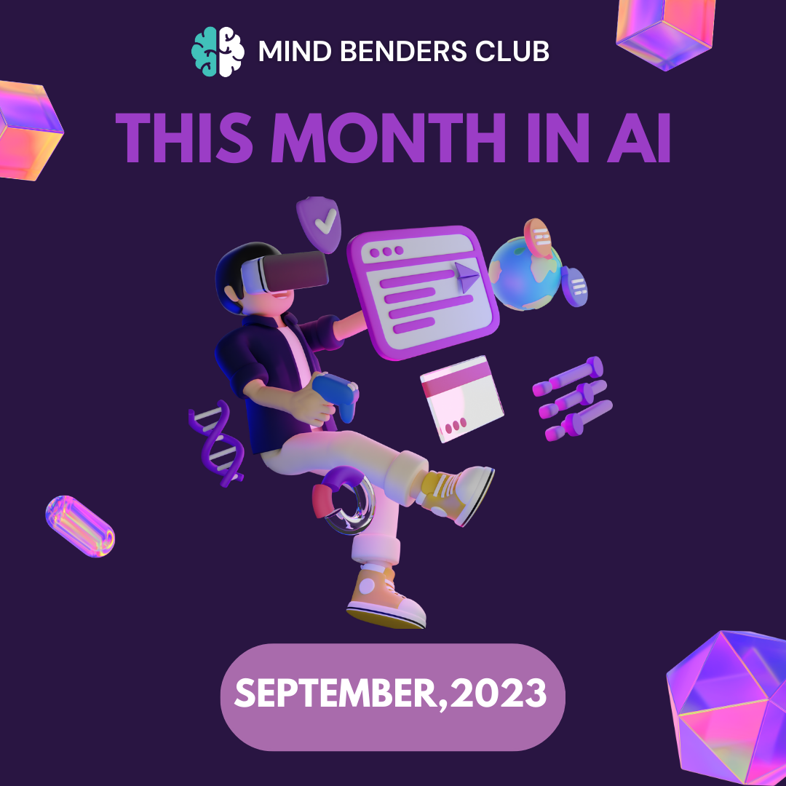
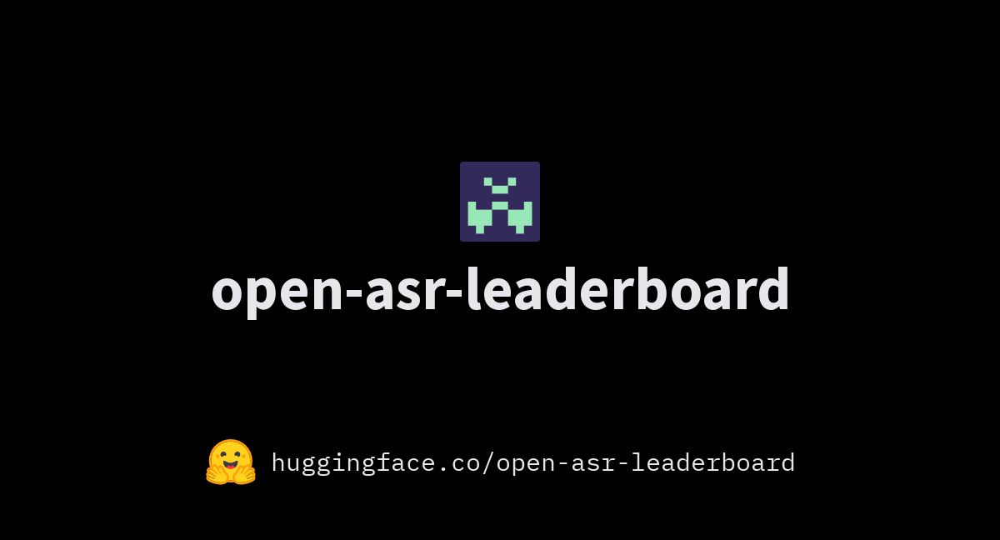
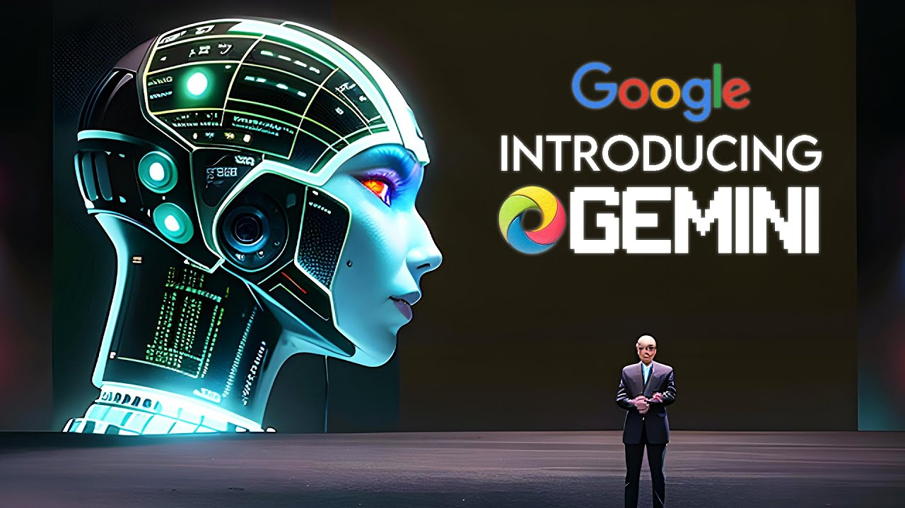
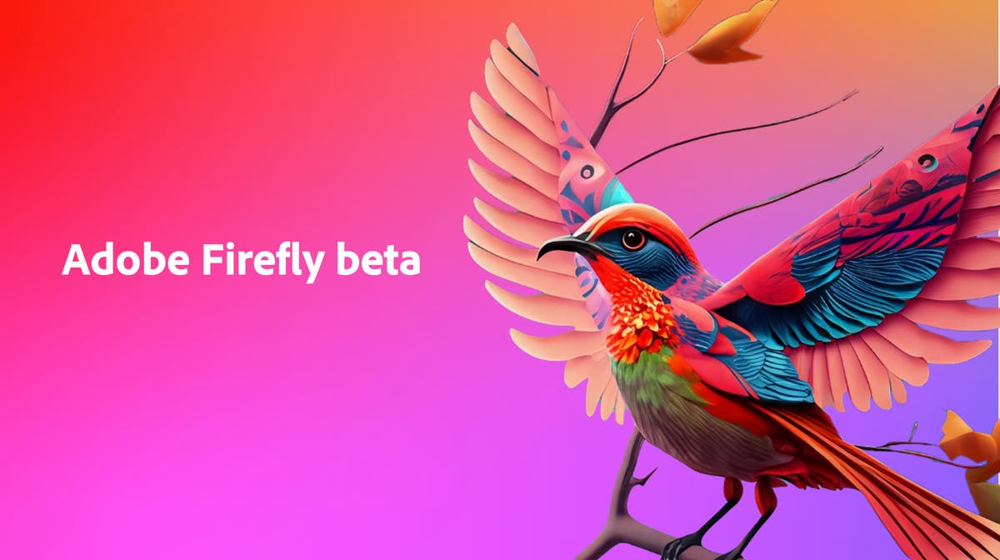
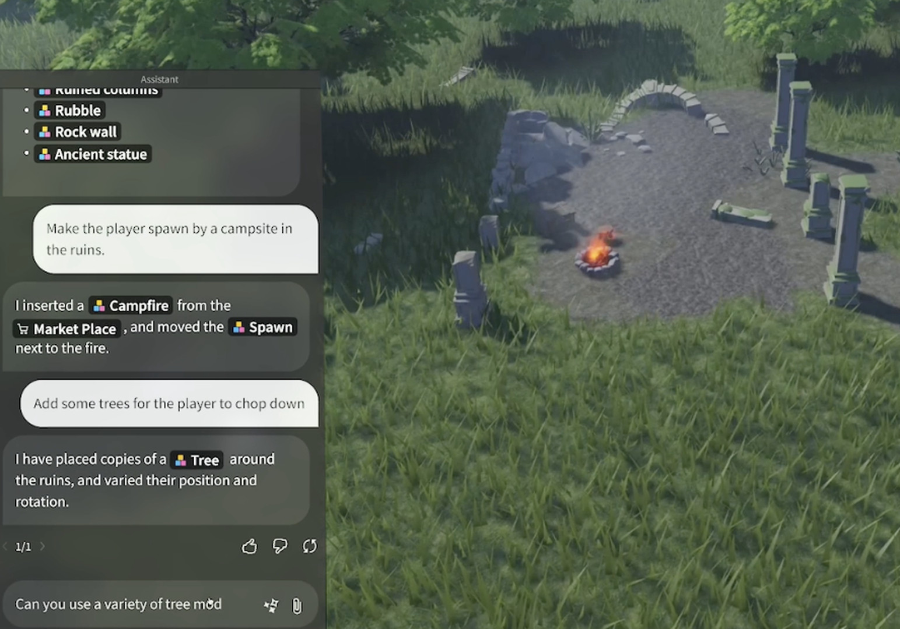
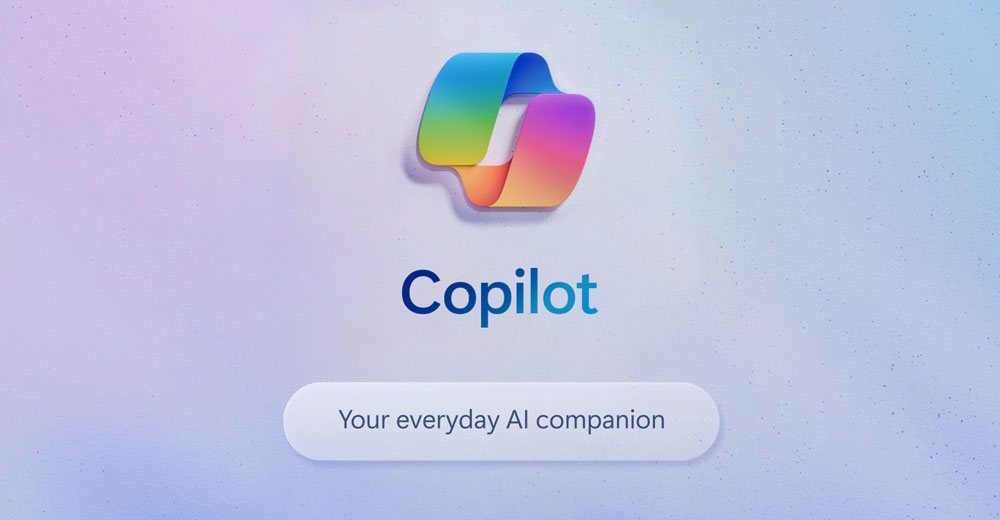

## The Latest Breakthroughs in AI: A Look at Recent Developments

In the ever-evolving world of artificial intelligence, groundbreaking innovations are constantly emerging. From speech recognition advancements to music generation and everything in between, the AI landscape is teeming with exciting developments. In this blog, we'll delve into some of the most noteworthy recent achievements in AI technology.

<!--truncate-->

---

## Open ASR Leaderboard: Leading the Way in Speech Recognition [^1]

Hugging Face, a prominent AI platform, has introduced the Open ASR Leaderboard, a platform that ranks and evaluates speech recognition models. The current top performers are NVIDIA FastConformer and OpenAI Whisper, both excelling in English speech recognition. The future promises multilingual evaluation, expanding the reach and capabilities of these remarkable speech-to-text models.

---

## Stable Audio: Crafting Music with AI Precision [^2]

Stability AI, a London-based startup known for its AI model Stable Diffusion, has unveiled Stable Audio. This cutting-edge AI model empowers users to generate high-quality commercial music with unprecedented control over synthesized audio. With this tool, music creation takes on a new dimension, offering artists and producers innovative ways to express their creativity.

---

## Google's Gemini: The Next Generation of Language Models [^3]

The Information has reported that Google is on the verge of launching Gemini, an advanced language model poised to rival GPT-4. Currently in early testing, Gemini boasts a wide array of functionalities, including chatbots, text summarization, and code writing assistance. This development promises to elevate the capabilities of AI-powered language models to new heights.

---

## Adobe's Firefly: Generative AI in Creative Cloud [^4]

Adobe has taken a bold step by releasing generative AI models within its Creative Cloud ecosystem, complete with a standalone web app named Firefly. The unique "generative credits" system allows users to control their interactions with Firefly's AI models, with each click on 'generate' utilizing one credit. This innovation opens up fresh avenues for creative professionals to explore their artistic potential.

---

## Roblox Assistant: Elevating Virtual World Creation [^5]

The 2023 Roblox Developers Conference introduced the Roblox Assistant, a conversational AI tool designed to assist creators in crafting immersive virtual experiences. With this tool, creators can easily generate virtual environments and implement basic gameplay behaviours, promising a more accessible and streamlined development process.

---

## Microsoft Copilot: Your Personal AI Companion [^6]

Microsoft Copilot is set to become an everyday AI companion, offering tailored assistance based on workplace data and web context. This AI powerhouse enhances productivity and creativity across Windows 11, Microsoft 365, Edge, and Bing, all while prioritizing user privacy. Bing and Edge users will also enjoy personalized experiences powered by OpenAI's DALL.E 3 model, including AI-driven shopping and image creation.

---

## Bard Extensions: Bridging the Gap with Google Services [^7]

The newly introduced Bard Extensions feature provides AI professionals with seamless integration with various Google tools. This enables efficient collaboration by fetching and displaying relevant information from Gmail, Docs, Drive, Maps, YouTube, Flights, and hotels, regardless of its scattered nature.

---

In conclusion, the world of AI continues to push boundaries and deliver game-changing innovations. From speech recognition advancements to music generation, language models, creative tools, virtual world building, and personal AI companions, these developments are shaping the future of AI technology and its impact on our daily lives. Keep an eye on these breakthroughs as they usher in a new era of possibilities.

---

[^1]: [Open ASR Leaderboard](https://huggingface.co/spaces/hf-audio/open_asr_leaderboard)   
[^2]: [Stable Audio](https://www.stableaudio.com/)
[^3]: [Google's Gemini](https://www.reuters.com/technology/google-nears-release-ai-software-gemini-information-2023-09-15/)
[^4]: [Adobe's Firefly](https://techcrunch.com/2023/09/13/adobes-firefly-generative-ai-models-are-now-generally-available-get-pricing-plans/?guccounter=1)
[^5]: [Roblox Assistant](https://www.theverge.com/2023/9/8/23863943/roblox-ai-chatbot-assistant-ai-rdc-2023)
[^6]: [Microsoft Copilot](https://blogs.microsoft.com/blog/2023/09/21/announcing-microsoft-copilot-your-everyday-ai-companion/)
[^7]: [Bard Extensions](https://blog.google/products/bard/google-bard-new-features-update-sept-2023/)
