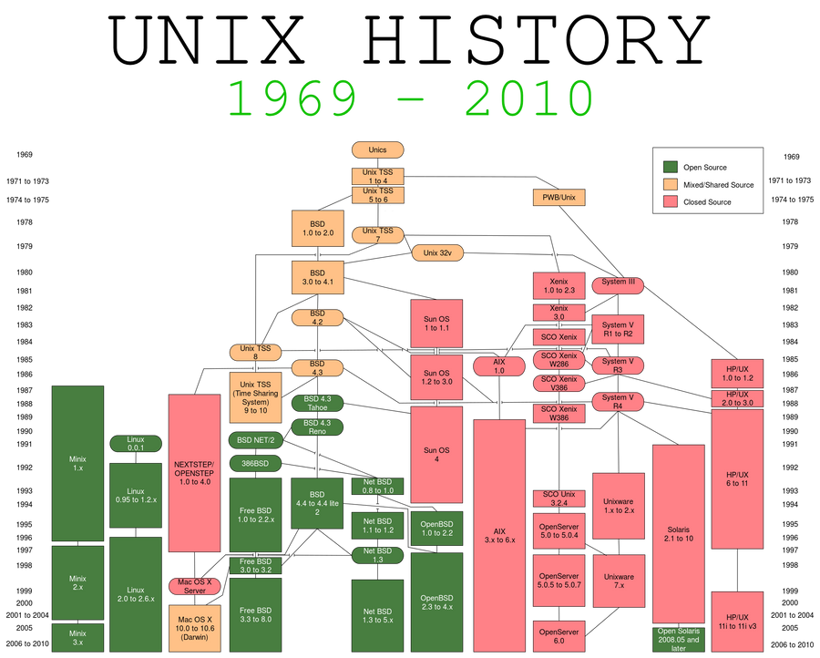
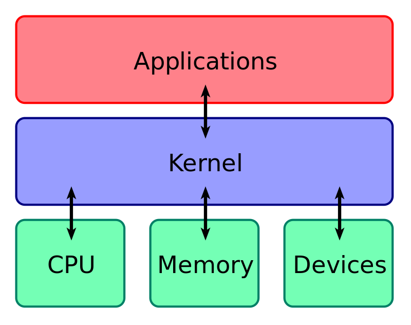

Linux is an operating system kernel. It was originally written in 1991 by Linus Torvalds for his personal use, and it was soon adopted as the kernel for the GNU operating system, which was written to be a free (libre) replacement for Unix. 

So, what even is GNU/Linux? What is free software? You must have so many more questions! Through this blog, we will try to understand what is linux, and why it is the most popular operating system in the world. 

<!--truncate-->

## The world of operating systems
Most modern opearting systems can be grouped into two categories:
- Microsoft NT descendants like Windows XP to Windows 11, Xbox OS, Windows Phone
- Unix based (Mostly everything apart from Windows)

### Why UNIX based?
Well, the answer is simple. Most of unix-based operating systems are free to use or modify, and hence are widely adopted. UNIX itself has died today, however, it's clones and descendants are still alive. Some of these operating systems are direct clones of the UNIX source code, while some such as Linux are UNIX-like. Errr.. so unix-based, unix-like, what are all these?

Don't worry, I will cover this in the next section. What's important in this section is you understand the fact almost everything that is not based on Microsoft NT is a direct or indirect descendant of UNIX. Some examples of operating systems that are descendants of UNIX are:
1. Linux and it's derivative distributions
2. Mac OS X
3. BSD 
4. ChromeOS 
5. Android
6. PS4 OS

Why is this important? Because all of these operating systems here share a plethora of common core functionailty. To put it simply, most of their internals and most of their functions are same, if not, similar. For example, all of these operating systems have the same basic commands.

## History of operating systems
Since most of the operating systems today can trace their lineage to UNIX, it is important to atleast have a brief idea of what UNIX is, even though the original versions of UNIX no longer survive. Understanding the history will also help you understand why UNIX-based commands do not work on something like Windows.

### What is UNIX?
UNIX was an operating system, developed at Bell labs in mid 1960s. Many of their innovations and design choices of the original UNIX team have lived up to 60+ years, well into the 2020s. These design choices include the idea of a multiuser operating system and a hierarchical filesystem.

UNIX truely is the grandfather of all modern operating systems. All of these features that were built into different versions of the original UNIX operating system still exist in operating systems like Mac OS, Android, linux distributions and basically every thing that can trace their lineage back to UNIX.

Since Microsoft operating systems cannot trace back their lineage to UNIX, all UNIX features do not work on windows. The commands that you can run colloquially on both MacOS and Linux, do not exist natively on Windows. Windows has it's own commands, and it's own way of doing things.

<b>FIG 1:</b> UNIX's descendants

### Closed Source, Mixed Source, and Open Source
In the diagram in the above section, you can see a legend in the top right that annotates the color codes given in the diagram. These are:
- <b>Closed Source</b> (denoted by Red): These were descendants of UNIX that were further developed by companies like Sun Microsystem, HP, etc. The source code of these developements of UNIX were strictly guarded. The code itself was kept a secret from the public and the clients did not have the permission to change or alter the source code in anyway. Each company had their own non-permissive license.
- <b>Mixed Source</b> (denoted by Yellow): These were the descendants of UNIX that were further developed by colleges like Univesity of California, Berkeley, and many others. Berkeley was influential as they had released a mixed source code license (also known as BSD license), that would allow sharing and modification of the source code, with other colleges and companies, for educational or other purposes. 
- <b>Open Source</b> (denoted by Green): These were descendants of UNIX whose developement was done in public as their source code was made freely available for everyone to view, modify, and use. The license that governed open source software were early versions of the GNU public license(GPL). The GPL from the early days has been a really permissive license as it allowed inspection and modification of the source code as per requirement.

Licensing was the key differentiator in all of these descendants of UNIX, as they governed what could be done with the operating system. Companies have to make a profit, and colleges have to follow certain rules, hence we can understand why the first two cases wanted to safeguard their code behind non-permissive licenses. But why did the third case not want to protect their code?

The answer is, as mentioned in the above two scenarios, software was a commodity that had to be purchased. The closed source versions were to be bought by clients. (Just like you buy a windows license). These were expensive to do so and also there were limited innovations in the software, like only in the company who built it or the college where it was developed. Hence, the Free Software Foundation was formed in the late 80s to solve this issue, and that is why they had created the GPL.

### Free Software Foundation (FSF)
The free software foundation was built as a part of the free software movement in response to proprietary and restricted software. Free is not equal to free in terms of money. Free as FREEDOM. That was FSF's motto.

The movement's philosophy is that computers and software should not prevent cooperation between users, and instead should have the goal of liberating everyone in the cyberspace. This will encourage innovation in software. 

According to the movement's leader <b>Richard Stallman</b>:
> Users should have the freedom to run, copy, distribute, study, change, and improve software.

This was a visionary statement as open source software allowed ground-breaking innovations in the software industry and today, most of the software we use, have some kind of free software in them, either completly or in parts.

### What is GNU/Linux?
Richard Stallman was the leader of a group of developers who wanted to create an open source version of the UNIX operating systems. Remember, most of the UNIX descendants like System V or BSD were closed source or mixed source? The open source operating system needed to have everything that normally came with UNIX. The components had to be FREE, as stated in the previous section.

In 1984, they began working on the GNU project (GNU stands for GNU's not UNIX). Creating an operating systems however is a daunting task, even for the most experienced developers. Luckily for him, at the same time, a student in the University of Helsinki, Linus Torvalds was working on his operating system kernel, called Linux. 

In any operating system, the <b>kernel</b> is the most important and critical component. The kernel facilitates the interaction of the the hardware and other system software. At that time, while most parts of the GNU project were complete (including gcc -  compiler, open source implementations of all unix-commands, etc), the project lacked a kernel. Linus Torvalds combined his Linux kernel with the rest of the components of the GNU ecosystem, to create a full operating system. This was known as <b>GNU/Linux</b>.

<b>FIG 2:</b> Kernel in operating system

#### Linux is an operating system kernel that along with other system software components creates an complete operating system called as linux distribution.

### Difference between unix-based vs unix-like
In FIG 1, you can see that many of the closed and mixed source operating systems are directly linked to the original UNIX. This is because the companies and colleges that wanted to develop their own versions of UNIX paid a royalty to Bell Labs to acquire UNIX. This might sound contradictary to their own non-permissive licenses. However Bell labs decided that they did not want to be in the operating systems buisness, and instead wanted to focus on telecommunication and phone buisness. Hence they happily sold off their versions of UNIX. Since these companies directly got their versions of UNIX from Bell labs, their descendant operating systems were called <b>unix-like</b>. 

There are a bit of legal reasons too that I will not cover in the blog as it is out of scope for our discussion, but to put it in simple terms, there was a foundation formed by a few of these companies called <b>The Open Group</b>, and they defined the UNIX standard according to their developements of UNIX. In FIG 1, you can see that most of the operating systems do not have a direct connection to UNIX. This is because even though they are based on the original UNIX and are compatible with the UNIX standards, they have not been certified by The Open Group. This is often due to financial considerations, as open source projects do not have a definite source of income. Hence these operating systems are called <b>Unix-like</b>. It is basically a matter of certification by The Open Group, simply put.

## Linux Distributions
You know that Linux is actually an operating system kernel and not an entire operating system in itself. When people talk about a linux based operating system, they are actually referring to Linux Distributions (often shorten to linux distro). Normally, a Linux Distribution bundles the linux kernel, a bunch of GNU tools, a shell, a package manager, a windowing system, and a window manager or desktop enviroment at the very least. On top of that, a linux distribution often can include utility software such as web browsers, a file explorer, a text editor, etc.
Did you know that Linux is actually an operating system kernel and not an entire operating system in itself? When people talk about a linux based operating system, they are actually referring to Linux Distributions. Normally, a Linux Distribution bundles the linux kernel, a bunch of GNU tools, a shell, a package manager, a windowing system, and a window manager or desktop enviroment at the very least. On top of that, a linux distribution often can include utility software such as web browsers, a file explorer, a text editor, etc.

### Types of Linux Distributions
While there are hundreds of linux distributions, most of them are based on a few original ones. These are:
- Arch Linux
- Debian Linux
- Red Hat Linux
- Slackware
- Gentoo
- NixOS
- Void Linux

The key difference between these distributions are usually their package managers. However, different distributions may choose to ship different types of components. Let's look at them in brief:

| Distribution | Package Manager | init system | 
| ------------ | --------------- | ----------- |
| Arch Linux   | pacman          | systemd     |
| Debian       | apt or dpkg     | systemd     |
| Red Hat      | dnf or yum      | systemd     |
| Slackware    | slackpkg        | bsd-style   |
| Gentoo       | portage         | openrc      |
| NixOS        | nix             | systemd     |
| Void Linux   | xbps            | runit       |

These distributions are often called parent distributions as many other distributions are derived from them. Derivatives retain the package manager of the parent distributions while shipping different components. For example - a different shell, a different filesystem, etc.

#### Well known derivative distributions
- <b>Arch based</b>: Manjaro, EndeavourOS, Garuda Linux
- <b>Debian based</b>: Ubuntu, Linux Mint, ElementaryOS
- <b>Red Hat Based</b>: Fedora, CentOS, RockyLinux
- <b>Gentoo based:</b> RedstarOS, Funtoo

### Core Components of a distribution
As we have discussed, a linux distro comes with the linux kernel, a shell, a filesystem, a bunch of GNU tools, and other system software. Let us discuss in brief what each of these components do, and how they help the operating system function.

#### Kernel
The kernel is a computer program at the core of a computer's operating system and generally has complete control over everything in the system. It is the portion of the operating system code that is always resident in memory and facilitates interactions between hardware and software components.

#### Init System
Init system (short of for <i>initialization</i>), is the first process started during booting of the operating system. Init is a daemon process that continues running until the system is shut down. It is the direct or indirect ancestor of all other processes and automatically adopts all orphaned processes. Init is started by the kernel during the booting process. The process ID of init system is <b>PID 1</b>. 

The init system with the help of the kernel initialises all hardware on the computer. The init scripts are launched by the init process to guarantee basic functionality on system start and shutdown. This includes (un)mounting of file systems and launching of daemons (background services).

#### Filesystem
A file system or filesystem controls how data is stored and retrieved. Without a file system, information placed in a storage medium would be one large body of data with no way to tell where one piece of information stops and the next begins. By separating the data into pieces and giving each piece a name, the information is easily isolated and identified. Taking its name from the way paper-based information systems are named, each group of data is called a "file". The structure and logic rules used to manage the groups of information and their names is called a "file system".

#### The shell
From Wikipedia: 
>A Unix shell is a command-line interpreter or shell that provides a traditional user interface for the Unix operating system and for Unix-like systems. Users direct the operation of the computer by entering commands as text for a command line interpreter to execute or by creating text scripts of one or more such commands.

A shell is a computer interface to an operating system. It exposes the operating systems' services (init system for example) to human users. The shell takes our commands, and gives them to the operating system to perform. It is called a shell because it is an outer protective layer around the operating system.

#### GNU tools
These are important tools that are present in some or other form since the UNIX days. The GNU toolchain is a broad collection of programming tools produced by the GNU Project. These tools form a toolchain (a suite of tools used in a serial manner) used for developing software applications and operating systems. 

#### Package manager
From Wikipedia:
> A package manager or package-management system is a collection of software tools that automates the process of installing, upgrading, configuring, and removing computer programs for a computer in a consistent manner.

A package manager deals with packages, distributions of software and data in archive files. Packages contain metadata, such as the software's name, description of its purpose, version number, vendor, checksum (preferably a cryptographic hash function), and a list of dependencies necessary for the software to run properly. Upon installation, metadata is stored in a local package database. Package managers typically maintain a database of software dependencies and version information to prevent software mismatches and missing prerequisites. They work closely with software repositories, binary repository managers, and app stores. 

#### Desktop Enviroment 
A desktop environment bundles together a variety of components to provide common graphical user interface elements such as icons, toolbars, wallpapers, and desktop widgets. Additionally, most desktop environments include a set of integrated applications and utilities. Most importantly, desktop environments provide their own window manager, which can however usually be replaced with another compatible one.

The user is free to configure their GUI environment in any number of ways. Desktop environments simply provide a complete and convenient means of accomplishing this task.

## What's Next?
After reading this blog, you must have gotten the basic understanding of what GNU/Linux is, what linux itself is, and what a linux distribution is, and what it does. Moving on from here, you can dive deep and understand in depth how each component decsribed in the blog post work. For example, how does a typical linux file system look like. The world of operating systems is vast, and only so much can be covered in one blog post. 
Keep asking questions, and keep reading!  