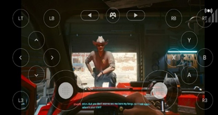
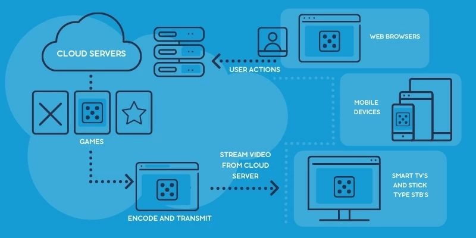
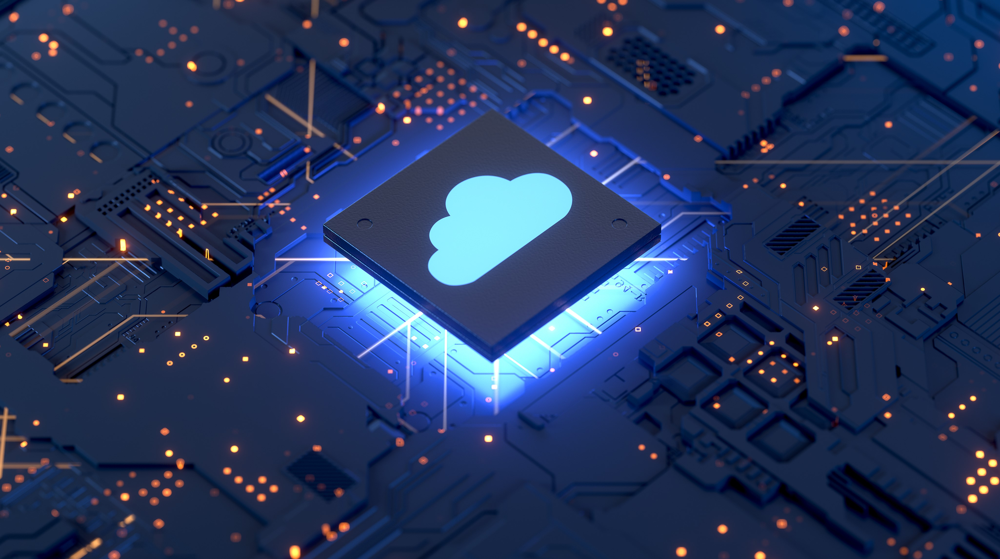

# Exploring the Future of Gaming: Cloud Gaming Unveiled

Hey there, fellow gamers! Today, we're diving into the fascinating world of **cloud gaming**, a technology that's changing the way we play and enjoy our favorite titles. In this article, we'll break down the concept of cloud gaming, its evolution, and its promising future.

## Introduction to Cloud Gaming

Imagine playing high-quality video games without the *need* for expensive gaming hardware or the hassle of *downloading and installing massive game files*. That's the magic of cloud gaming! It's like Netflix for gamers, where you can instantly access and play games over the internet without worrying about hardware requirements.

Most modern games demand a hefty amount of storage space and powerful hardware to run smoothly. Think about titles like Call of Duty's Warzone, which takes up over 1000GB of storage. To play these games with the best experience, you'd need a high-end PC or gaming console. But what if there was a more affordable alternative?

## How Cloud Gaming Works

Cloud gaming operates within the realm of cloud computing. Instead of storing game files on your local device, they're hosted and processed on powerful remote servers in data centers. Here's how it works in a nutshell:

+ **Remote Servers**: Powerful servers host and run the games, eliminating the need for you to download and install them on your device.

+ **Streaming Gameplay**: Similar to streaming services like Netflix, cloud gaming sends a video stream of the gameplay over the internet to your device.

+ **Input Control**: Your inputs (the buttons you press and the moves you make) are sent to the server, where the game responds accordingly. This allows you to play even on low-end devices.

While cloud gaming offers incredible convenience, it's important to note that it can introduce some input lag, depending on factors like your internet connection stability and the distance between you and the server.

*Cloud Gaming is one of the Best Examples to showcase the power of Cloud Computing.*

## The History and Future of Cloud Gaming

In the past, cloud gaming faced numerous challenges, including network issues. Google's attempt with Google Stadia was ambitious but struggled due to connectivity problems. Other giants like Amazon and Microsoft also entered the arena with Amazon Luna and Xbox cloud gaming.

However, the future of cloud gaming looks bright, especially in countries like India. Gaming is growing rapidly, and cloud gaming provides an affordable platform for those unable to invest in high-end gaming hardware. The potential to earn rewards through gaming is also on the rise, further boosting its popularity.

The primary challenge facing cloud gaming today is network-related issues, but providers are actively working on solutions to make it accessible to more users.

We can say Cloud Gaming was just the first step for the cloud computing service to even non-tech users.
Google is developing & testing Cloud Quantum computing so that one day everyone can access the Incredible power of Quantum computers without the need for a quantum rig, which might be bigger than most of our houses.

## Advantages and Drawbacks of Cloud Gaming

Cloud gaming offers several advantages, including:

- **Universal Platform**: You can play games on any device with an internet connection, from consoles to smartphones.

- **Cost-Efficiency**: No need for expensive hardware, as the processing is done on remote servers.

- **Portability**: Play on the go without worrying about installation and setup.

However, it's not without its drawbacks:

- **Internet Dependency**: A stable internet connection is crucial for a smooth experience.

- **Input Lag**: Some games may suffer from input delay due to server processing.

- **Limited Awareness**: Many people are still unaware of cloud gaming, and few providers exist compared to traditional gaming options.

## Current Status of Cloud Gaming

Several cloud gaming services are making waves in the industry:

- [x] **Nvidia GeForce Now**: This service is known for its low system requirements, compatibility with various devices, and a free trial period.
- [x] **XBox Game Cloud**: Known for Various game titles for free to play in the subscription of Game Pass.
- [x] **JioGames Cloud**: Building the Cloud gaming culture & infrastructure in India at a reasonable rate.

## Is Cloud Gaming Worth It?

While cloud gaming shows immense potential, it's still in its early stages. Input lag and connectivity issues can be frustrating, especially for competitive gamers. Traditional gaming setups remain a popular choice. However, as technology advances, cloud gaming has the potential to become the future of gaming in the coming decade.

In conclusion, cloud gaming is a game-changer with the potential to democratize gaming by making it accessible to more players. As it evolves and overcomes its current challenges, we can expect cloud gaming to reshape the gaming landscape in the near future.

## References:

- [Nvidia GeForce Now](https://www.nvidia.com/en-us/geforce-now/)
- [PlayStation Now](https://en.wikipedia.org/wiki/PlayStation_Now)
- ~Google Stadia~ (closed right now)
