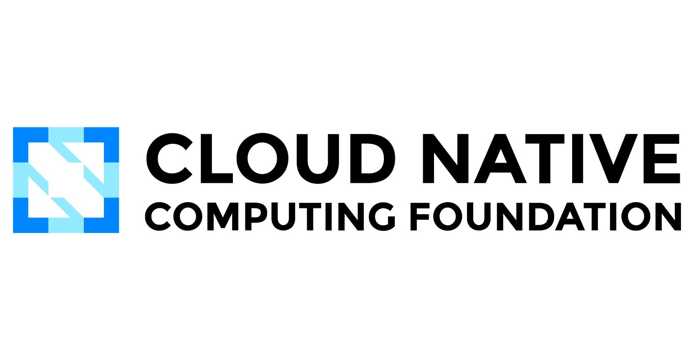
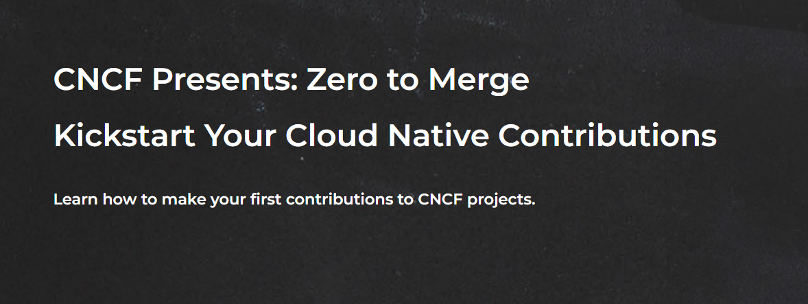

> CNCF Zero to Merge is a program by the Cloud Native Computing Foundation that helps newcomers make their first open-source contribution. It aims to lower the barrier for people who have never contributed to open source before, especially those from underrepresented groups. This blog summarizes my experience in the first-ever edition of the program
 

# CNCF Zero to Merge - Your first step towards Open-Source

<!--truncate-->

## Introduction

This blog summarizes my experience with the Cloud Native Computing Foundation's first edition of the newly launched Zero to Merge Incubator Program. This program was launched with the primary aim of getting new folks involved in Open-Source. I learned about this program from one of the LinkedIn posts by [Rohit Ghumare](https://github.com/rohitg00). If you are willing to register for the program, you can check out the link [here](https://project.linuxfoundation.org/cncf-zero-to-merge-application). CNCF will not conduct any such programs as of this year, but you should keep an eye on the page for future proposals.

The CNCF Zero to Merge Program is a 4-week long program with 2 sessions per week. According to the Indian Standard Time, the sessions were held on Monday and Thursday from 9:30 p.m. to 10:30 p.m. each week.

## During the program

**Week 1 Session 1**: The initial session of the program's first week served as an orientation, acquainting participants with the program itself, its instructor, and the schedule. This session predominantly centered on key topics, including an introduction to open-source principles and the CNCF (Cloud Native Computing Foundation). It also covered the art of selecting suitable open-source projects for contribution and the necessary prerequisites for effective participation in the open-source community.

**Week 1 Session 2:** During the second session of the first week, participants focused on acquiring knowledge about essential tools like CLOTributor for narrowing down project options that align with individual preferences. The session also delved into important concepts such as GitHub and Git basics, GitHub Actions, and expanded insights into The Linux Foundation.

**Week 2 Session 1:** In the second week of our CNCF program, we delved into the history and progress of CNCF projects, exploring what motivates individuals to contribute to open-source initiatives. Our instructor, Taylor Dolezal, left a lasting impression with his fantastic and approachable teaching style. In addition to valuable insights, he provided a practical demonstration of the entire process, from forking a repository to creating a pull request (PR).

**Week 2 Session 2:** The session was centered around exploring the topics of Cloud Native Evolution and Cloud Native Trends, featuring active engagement through a question-and-answer format where the instructor either provided answers or directed participants to relevant articles and white papers. Towards the end, attendees were tasked with homework, which involved finding a project that aligned with their interests in the subject matter.

**Week 3 Session 1:** In the third week, participants were allowed to take the spotlight by presenting their screens. They were encouraged to share their involvement in various projects, showcasing their approach to addressing the issues at hand and detailing their interactions with project maintainers.

**Week 3 Session 2**: This session was primarily intended for clearing doubts and addressing any questions or uncertainties participants may have had.

**Week 4 Session 1:** The first session of the last week had the following agenda: Hot seat opportunity: During this segment, participants had the chance to share information about their projects, issues, or the specific focus of their pull requests, offering an opportunity for discussion and feedback. Live lesson: The session included a live lesson where the participants reviewed the CNCF (Cloud Native Computing Foundation) website and learned how to navigate through its resources and additional learning materials.

**Week 4 Session 2:** The program has concluded, marking a moment of celebration, friendly conversations, and discussions about the future steps for all the attendees.

## Key Takeaways from the Program

CNCF Zero to Merge is a great program for beginners to open source. It provides guidance and mentorship to help you contribute to open source for the first time.

Here's a summary of the process:

**1. Find a Project:** Choose a CNCF incubating project that interests you and has welcoming maintainers.

**2. Understand the Issue:** Read the issue or bug report you want to work on thoroughly and clarify any doubts with the maintainers.

**3. Fork the Repository:** Create a fork of the project's repository on your GitHub account to work on your changes separately.

**4. Make a Branch:** Create a new branch in your fork to isolate your work and make it easier to create a pull request later.

**5. Make the Changes:** Code the fix or feature as described in the issue. You can do this locally and then push the changes to your forked repository.

**6. Test Your Changes:** Run any tests and commands mentioned in the project to ensure your changes work as intended. You may need to write new tests.

**7. Create a Pull Request:** Using GitHub, create a pull request from your branch to the upstream repository. The maintainers will review your code and provide feedback.

**8. Iterate Based on Feedback:** Make any requested changes based on the review and commit these changes to your branch so that the pull request updates automatically.

**9. Merge:** Once the maintainers approve your changes, they will merge your pull request, and your contribution becomes part of the project.

**10. Celebrate:** Congratulations, you've successfully made your first open-source contribution! You are now an official contributor to the project.

This program is a great way to get started with open source and can be very rewarding. It's important to be patient and open to feedback from maintainers, as it helps improve your skills and contribute positively to the project.

## Conclusion

This is a great step-by-step guide for making your first open-source contribution to a CNCF incubating project. It's important to follow these steps carefully to ensure a smooth and successful contribution experience.

The CNCF Zero to Merge initiative is a great way for newcomers to open source to get involved and make meaningful contributions. By focusing on small, self-contained issues that need fixing, new contributors can learn about the process of contributing to open-source projects and gain confidence. With proper mentorship and guidance, new contributors can progress from fixing typos to making more substantial code contributions that improve the project.
