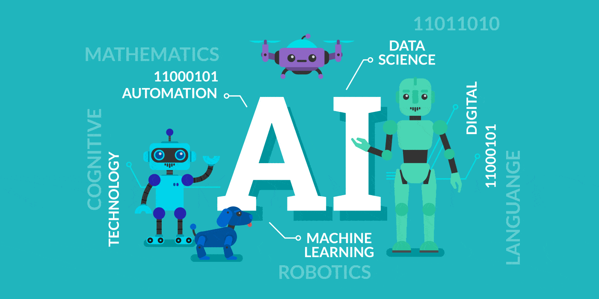

>Artificial Intelligence (AI) is becoming more and more crucial in influencing how we work and live in today's quickly changing technology landscape. Automation is one of the most interesting uses of AI because it has the ability to boost productivity, streamline procedures, and usher in a smarter era. We'll look at the main aspects of AI automation in this post.

<!--truncate-->
 

|  |
| :--: |
| *Automation* |

## What is AI Automation ?

- Artificial Intelligence (AI) automation is the use of machine learning and artificial intelligence to carry out activities automatically. 
- By minimizing human mistake and working nonstop, it achieves tremendous efficiency gains that lower costs and increase profitability. 
- Simple rule-based processes to more complicated, adaptive, and intelligent behaviors can all be automated.
- Basic purpose of AI automation is to use AI capabilities to make tasks more efficient, accurate, and cost-effective. 
- This technology can process enormous amounts of data, make predictions about the future, and customize user experiences. 

## Power of AI Automation

AI automation has the capacity to completely alter industries and redefine how we live and work.  It improves customer service, supports decision-making, and encourages innovation while being accessible 24/7. AI automation is a versatile force with broad ramifications across industries as it improves resource allocation, simplifies operations, and reduces risks. Its capacity to boost human potential and promote ongoing improvement highlights its crucial role in determining the course of the future.  The nexus of Automation and Artificial Intelligence (AI) has expanded quickly, spawning cutting-edge tactics that promise to fundamentally transform industries and expedite procedures. This technology is a game-changer in many industries because it can undertake repetitive, time-consuming jobs with higher accuracy, consistency, and speed than people. 

import jobs from "./jobs.jpg";

<figure>
    

    
<figcaption>Affect of AI Automation on Jobs</figcaption>

</figure>

## Evolution of AI Automation

AI automation has come a long way from basic rule-based processes. Today, it combines machine learning, natural language processing, and other AI techniques to deliver more sophisticated and adaptive solutions. 
Here are some advanced AI automation strategies:

<b>Cognitive Automation</b>

AI and human intelligence are used in cognitive automation to simulate human thought processes. It can make judgments, comprehend unstructured data, and even pick up new information as it is input. In industries like healthcare, where it may help with diagnosis and treatment suggestions, this technology is extremely beneficial.

<b>Predictive Maintenance</b>

Machine learning algorithms are used in AI-powered predictive maintenance to predict when equipment will break down. By just maintaining machines as needed, this aids businesses in avoiding unanticipated downtime and lowering maintenance expenses.

<b>Conversational AI</b>

Natural language processing is used by conversational AI, which is frequently found in chatbots and virtual assistants, to engage in discussions that are human-like. This is extremely helpful for increasing user experiences, automating regular enquiries, and improving customer support.

<b>Robotic Process Automation (RPA)</b>

Routine, rule-based processes across numerous applications are automated by RPA. In order to eliminate human data entry and boost efficiency, it is commonly utilized in finance, HR, and logistics.

## Benefits 

Here are some of the ways AI automation can benefit your organization :

import benefits from "./benefits.png";

<figure>
    

    
</figure>

## Navigating the Future of Work

AI automation is not just about cost savings and efficiency; it's about reshaping the very nature of work. 
The future of work, characterized by automation, presents several key facets:

- Innovation: As AI automation handles routine tasks, human workers can focus on more creative, strategic, and innovative endeavors, driving progress and innovation.

- Job Evolution: The workforce will see a shift in the nature of jobs. While some tasks become automated, new roles related to AI and automation will emerge.

- Continuous Learning: The future workforce will need to embrace lifelong learning and adaptability to remain relevant in an ever-changing job market.

- Ethical Considerations: As AI automation continues to expand, ethical considerations related to bias, transparency, and accountability become paramount.

import nature from "./nature.png";

<figure>
    

    
</figure>

## Conclusion

To summarize, the AI Automation Odyssey is a thrilling and revolutionary adventure with enormous potential to shape the future of work and creativity. The value of AI automation rests in its capacity to improve productivity, decrease errors, save money, and promote innovation across multiple industries. As its influence grows, the workforce must adapt to changing responsibilities and the continual requirement for lifelong learning. Ethical considerations are vital, and ethical AI automation deployment is required to ensure that it benefits society as a whole. The future of work is changing, and the opportunity for creativity is limitless.  

<b>Our adventure has only just begun and the future holds exciting discoveries, </b>

<b>Stay tuned for more insights and developments on this remarkable odyssey !!!!</b>

