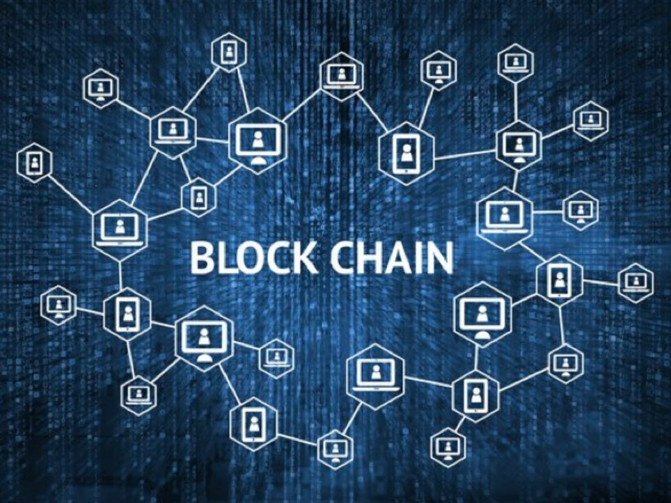
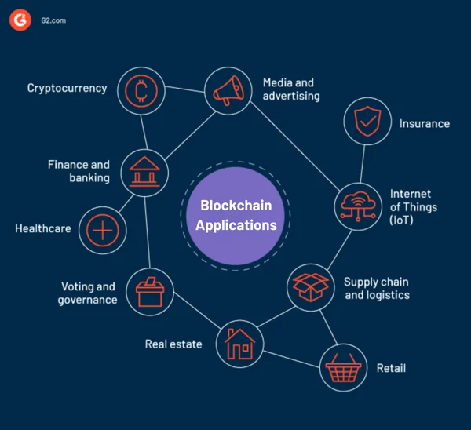

> Ever wondered what blockchain is and how it looks? Let's explore the realm of blockchain together. This blog focuses on the basics of blockchain technology along with its applications. In this evolving era, it is important to understand this technology because, according to  recent research, blockchain has the potential to reshape the future and the way we perceive it.

<!--truncate-->
 

|  |
| :--: |
| *Blockchain technology* |

 

# *What is Blockchain* ?  
 

Distributed database and immutable ledger used for recording transactions, tracking assets  and building trust is termed as blockchain. 
Let’s take an example: 
Imagine a blockchain as a super secure digital notebook for businesses. This notebook stores information in a special way. Instead of writing everything in one long list, it divides the information into blocks and connects them like a chain.
What's cool about this digital notebook is that once something is written in it, you can't erase it or change it without everyone in the network agreeing. It's like having a magical pen that only writes the truth.
So, businesses use blockchain to keep an unchangeable record of things like orders, payments, and accounts. It's like a super reliable ledger that makes sure nobody sneaks in fake or unauthorized entries. Everybody in the network sees the same information, so there's no confusion.

## *What does blocks of Blockchain consist of* ?
 

Blocks are the place or container which stores all information of user like transaction data being one of many examples and once the data is stored in blocks it cannot be altered again.
- Data : It is gives information about the user.
- [**Hash**](https://www.geeksforgeeks.org/blockchain-hash-function/): A hash is a mathematical function that turns any kind of information into a secret code with a specific length. It's like a machine that takes in any size of data and spits out a code that's always the same size
- Hash of previous block : Every consequent blocks are connected with the hash of previous block. So if any one alters the one block the whole chain will get disrupted and with this it is easy to track where the data alteration is performed.
  

|  |
| :--: |
| *Blocks of Blockchain* |

## *Different types of Blockchain Technology* 
 

<b>Public Blockchain </b>

Here anyone and everyone can participate in the core activities of the blockchain network. In this network system problems like centralization, less security, and less transparency don’t exist as it uses Distributed Ledger Technology( which means data is distributed across the network) . The very first example of this is Bitcoin. It enables everyone to perform transactions. Other examples of this include Litcoin and Ethereum. Use cases of public networks are in Document Validation and cryptocurrency.
 

<b>Private Blockchain </b>

A private blockchain is like a special club for a group of people or organizations. In this club, only those who are invited can join and participate. It's not open to the public, like the internet. Just like a public network it also stores data in a decentralised manner. As they are limited in their size, the transaction takes place very fast.
"You can think of private blockchains as being the intranet, while the public blockchains are more like the internet," Godefroy said.
Use cases of this are supply chain, internal voting, and asset ownership.

<b>Hybrid Blockchain </b>

In simpler words, a hybrid network is a combination of both private and public networks. Companies like real estate which want to keep some of their data private and need to show some information to the public like listings, use this type of network. According to Godfroy medical records can also be stored on this blockchain network where users can access their data without any third-party interruption.

<b>Consortium Blockchain </b>

 A consortium blockchain, also called a federated
blockchain, combines features of both private and public blockchains. It's like
a mix of the two. In this type of blockchain, several organizations work
together on a shared network, and not just one entity has control, reducing the
risks. It is more like a team effort instead of just one person or organization being in charge. Use cases for this network are Banking and payment.

##  *Why Blockchain is becoming integral part of our life* ? 
 

Blockchain technology has become a buzzword in recent times. Companies, institutions, and various transactions are rapidly adopting blockchain technology. Its popularity extends beyond cryptocurrencies like Bitcoin, and following are the important reasons why blockchain is gaining prominence:  

 1) <b>Decentalization</b> 
Traditionally, we relied on centralized authorities like banks and governments for our transactions and record-keeping. Additionally, the risks of data tampering and alteration were more significant than one could imagine. To address these issues, blockchain has emerged as a solution. At its core, blockchain embodies the concept of decentralization, which means data is not stored in one central location or controlled by a single organization. Instead, it enables the distribution of control and verification across a network of participants.

2) <b>Smart Contracts</b> 
[**Smart Contracts**](https://www.ibm.com/topics/smart-contracts#:~:text=Next%20Steps-,Smart%20contracts%20defined,intermediary's%20involvement%20or%20time%20loss.), residing on blockchain technology, execute automatically when predefined conditions are satisfied, eliminating the need for intermediaries such as banks or attorneys. Parties encode contract terms, ensuring immediate execution upon meeting conditions, reducing costs, and optimizing efficiency.

3) <b> Transparency and Security</b> 
Blockchain technology provides a transparent system where all activities are visible to the public. Since blockchain is a decentralized and distributed ledger, all transactions on the internet are accessible to all network participants. Blockchain achieves transparency through the use of encryption methods for secure and unchangeable record-keeping. Blockchain security results from a combination of distributed consensus and cryptographic techniques.

4) <b>Intellectual Property (IP)</b> 
Intellectual property (IP) in blockchain involves ownership of digital assets, patents for blockchain innovations, smart contracts for IP agreements, and open-source licensing. Few methods with which blockchain technology make use of IP is: Patent, Copyrights,Trademarks and Trade secrets.

##  *Applications of Blockchain*  
 

Today, we cannot imagine our lives without the internet. It has become an integral part of our daily routines. Almost everything we do happens through the internet, and in some ways, we are highly dependent on it. Due to the sudden rise in the popularity of blockchain in the previous decade, it is estimated that, like the internet, blockchain will also become an integral part of our lives. It's applicatiion ranges from transaction, healthcare, cryptocurrency, [**bitcoin**](https://www.geeksforgeeks.org/what-is-bitcoin/), IoT and what not. The part of the tech industry that deals with online data and services is about to go through a big and important change because of blockchain technology.
  

|  |
| :--: |
| *Applications of Blockchain* |

## *Let us have a look at some drawbacks of Blockchain technology*
 

- The implementation cost of blockchain is very high. For a small company, it becomes difficult to shift to blockchain technology because they need to hire a skilled blockchain developer, and in addition to this, infrastructure costs will also be incurred, which require a significant amount of funding.
- The continuous operation of mining, minting, and transaction validation demands powerful systems that run non-stop. Beyond substantial investments, these activities consume significant amounts of energy, resulting in potentially severe environmental repercussions.
To address the negative environmental impact, China has taken the step of banning blockchain mining in the Inner Mongolia region.
- In the context of blockchain networks like Bitcoin, a 51% attack occurs when a single entity or group of entities controls more than 50% of the network's mining or computational power. This level of control can potentially allow them to manipulate transactions and disrupt the normal functioning of the network.

## *Conclusion*
 

In conclusion, blockchain's decentralization, smart contracts, and transparency offer transformative solutions across industries. Despite high implementation costs and environmental concerns, its impact is undeniable. Just as the internet integrated into daily life, blockchain is poised to shape the future of transactions and data management, promising an exciting path in technology and business.

