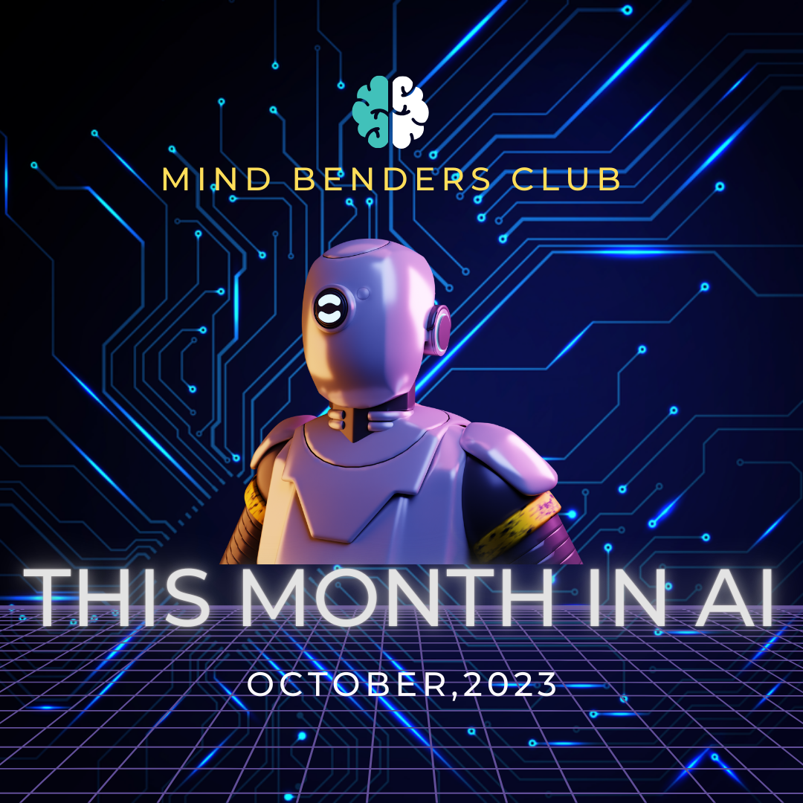
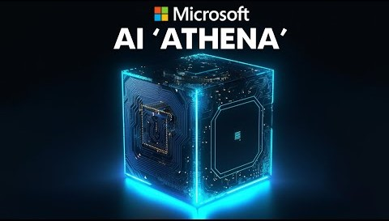
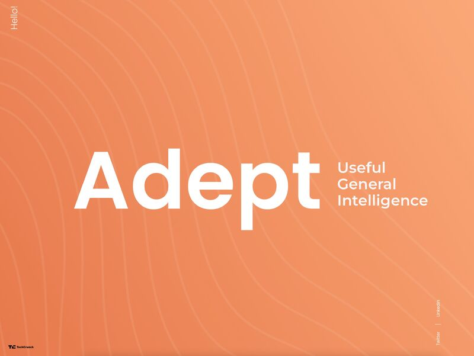

## Exciting AI Developments: October 2023

Artificial intelligence continues to make leaps and bounds, shaping the future in extraordinary ways. October 2023 has been an especially remarkable month for AI, with groundbreaking advancements and innovative solutions emerging from various organizations. In this blog, we'll delve into some of the most noteworthy developments in the world of AI.

<!--truncate-->

## 	ChatGPT: The Multifaceted AI Assistant

OpenAI's ChatGPT has undergone some transformative upgrades, making it a more capable AI assistant than ever before. The ability to search the web in real time is a game-changer, allowing users to access the most recent information. Notably, OpenAI has ensured compliance with robots.txt rules and user agent identification to give websites more control. Plus and Enterprise users are already enjoying these enhancements, with expansion plans on the horizon.

But that's not all. ChatGPT now possesses the ability to see, hear, and speak. With new voice and image capabilities, users can engage in natural voice conversations and receive relevant responses. Additionally, the image feature enables users to present images to ChatGPT for assistance in interpretation. These additions open up exciting possibilities for interactive and dynamic AI interactions.

##  Microsoft's Athena: A Game-Changing AI Chip

Microsoft is making waves in the AI hardware arena with the introduction of its own AI chip called Athena. This chip is set to reduce the company's reliance on NVIDIA GPUs and compete head-to-head with NVIDIA's H100 GPU for AI acceleration in data centers. This move showcases Microsoft's commitment to achieving self-sufficiency in AI hardware and driving innovation in the AI space.

##  Sturgeon: AI in Real-Time Brain Tumor Diagnosis

In the field of healthcare, "Sturgeon" is making waves as an AI model that utilizes nanopore sequencing to swiftly and accurately diagnose brain tumors. This innovation is set to revolutionize medical treatment by mimicking human brain activity and employing algorithms to recognize patterns and provide precise diagnoses within just 40 minutes. This kind of real-time AI application holds tremendous potential for improving patient outcomes and speeding up medical diagnoses.

##  OpenAI's AI Chip Consideration

In a related move, OpenAI is contemplating the development of its own AI chips for ChatGPT. This strategic consideration stems from a global shortage of processors for training AI models. Such a move could help reduce the exorbitant operating costs of ChatGPT, which currently amount to a staggering $700,000 per day. It's worth noting that OpenAI's decision may differ from Microsoft, their partner, who is also working on their own AI chips.

##  Stable LM 3B: Powering Smart Devices with AI

Stability AI introduces Stable LM 3B, a high-performing language model designed specifically for smart devices. Boasting 3 billion parameters, this model outperforms state-of-the-art 3B models while significantly reducing operating costs and power consumption. The result is an AI model that enables a broader range of applications on smart devices, PCs, and edge computing, paving the way for enhanced user experiences and improved efficiency.

##  Fuyu-8B: A Multimodal Marvel

Adept has unveiled Fuyu-8B, an impressive open-source vision-language model engineered to comprehend and respond to questions about images, charts, diagrams, and documents. This multimodal AI architecture promises to unlock new horizons in AI-driven image and document analysis, offering a plethora of applications in fields such as healthcare, education, and more.

In conclusion, October 2023 has been a momentous month for AI enthusiasts. With advancements in AI hardware, language models, multimodal AI, and real-time medical diagnosis, the landscape of artificial intelligence is evolving at an incredible pace. These developments not only reflect the cutting-edge capabilities of AI but also point to the potential for AI to transform industries and improve the quality of our lives. The future of AI is undoubtedly exciting, and it promises to bring more innovations and discoveries in the months and years to come.

[^1]: [ChatGPT can now see, hear, and speak] (https://openai.com/blog/chatgpt-can-now-see-hear-and-speak) 

[^2]: [Microsoft to Unveil In-House AI Chip, Reducing Reliance on NVIDIA ] (https://www.maginative.com/article/microsoft-to-unveil-in-house-ai-chip-reducing-reliance-on-nvidia/) 

[^3]: [AI real time brain tumour Diagnosis] (https://www.nytimes.com/2023/10/11/health/ai-tumor-diagnosis-brain-cancer.html) 

[^4]: [OpenAI is exploring making its own AI chips] (https://www.businessinsider.com/openai-is-considering-making-its-own-ai-chips-chatgpt-2023-10) 

[^5]: [Introducing Stable LM 3B: Bringing Sustainable, High-Performance Language Models to Smart Devices] (https://stability.ai/blog/stable-lm-3b-sustainable-high-performance-language-models-smart-devices) 

[^6] [Adept Fuyu-8B] (https://www.adept.ai/blog/fuyu-8b)