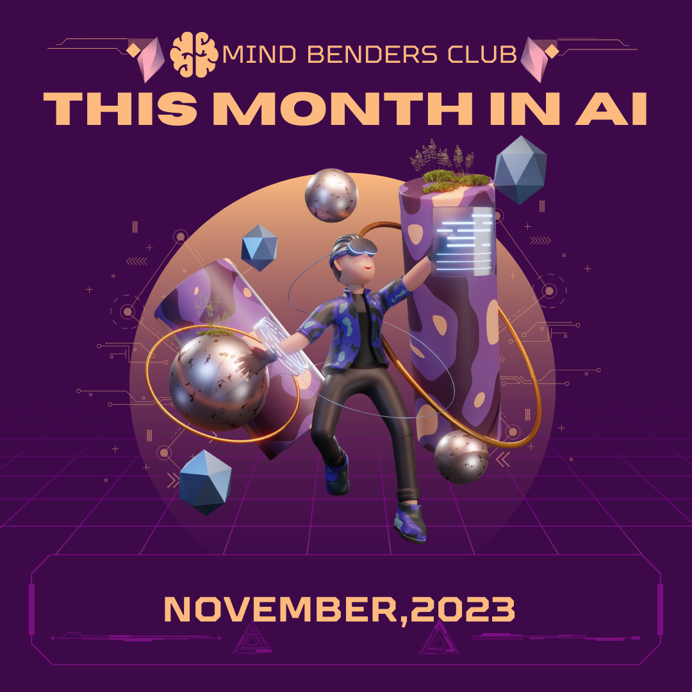

## Exciting AI Developments: November 2023

Artificial intelligence continues to make leaps and bounds, shaping the future in extraordinary ways. November 2023 has been an especially remarkable month for AI, with groundbreaking advancements and innovative solutions emerging from various organizations. In this blog, we'll delve into some of the most noteworthy developments in the world of AI.

<!--truncate-->

## 	RedPajama-Data-V2 [^1]
 
   - Explore the largest public training dataset, RedPajama-Data-V2, boasting 30 trillion tokens from 84 CommonCrawl dumps in multiple languages. With pre-computed quality annotations, it sets a new standard for language model research.

##  Grok: Elon Musk's Debut in AI Chatbots [^2]
   - Elon Musk's xAI introduces Grok, a chatbot available exclusively to X Premium+ subscribers. Harnessing real-time information from the X platform and backed by AI specialists from renowned organizations, Grok marks Musk's foray into the AI chatbot arena.
   
  

##  AlphaFold's Evolution: Revolutionizing Biomolecular Research [^3]
   - Delve into the next generation of AlphaFold, an advanced AI model reshaping our understanding of biomolecules. Its accurate predictions in the Protein Data Bank hold promise for applications in drug discovery, vaccine development, and environmental initiatives.

##  Anthropic's $2B Boost: Google Joins the AI Proxy War  [^4] 
   - Witness the intensifying AI proxy war as Google invests $2 billion in Anthropic, echoing the substantial commitments made by Microsoft and Amazon. The escalating competition among tech giants underscores the strategic importance of the AI industry.

##  Copilot's GitHub Revolution: AI Empowering Developers [^5] 
   - GitHub integrates AI through Copilot and Copilot Chat, ushering in a new era of software development. Powered by OpenAI's GPT-4 model, Copilot offers code understanding, suggestions, security fixes, and an enhanced developer experience.

##  NVIDIA Accelerates Pandas: GPU-Powered Performance [^6]
   - Witness the transformation of the Pandas library as NVIDIA achieves up to 150 times faster performance with GPU acceleration. The cudf.pandas module seamlessly executes operations on GPU or CPU, ensuring efficient synchronization and switching.

##  Neuralink's Surge: Thousands Eager for Brain Chip Implants [^7]
   - Elon Musk's Neuralink captures widespread interest as thousands line up for brain chip implants. Approved for human trials, the brain-computer interface aims to empower those with neurological disorders, opening avenues from device control to mind-based communication.

##  Stable Video Diffusion: Revolutionizing Generative Video [^8]
   - Stability AI introduces Stable Video Diffusion, a potent foundation model for generative video. Publicly accessible on GitHub and Hugging Face, this model has the potential to generate customizable frames at varying frame rates, shaping the future of AI-driven video generation.

  

November emerges as a pivotal month, marking significant strides in AI research, industry investments, and the unveiling of cutting-edge technologies.

[^1]: [Red Pajama](https://together.ai/blog/redpajama-data-v2)

[^2]: [Explore Grok](https://mashable.com/article/elon-musk-x-ai-update)

[^3]: [Alphafold ](https://deepmind.google/discover/blog/a-glimpse-of-the-next-generation-of-alphafold/)

[^4]: [Read about Google's investment](https://techcrunch.com/2023/10/27/ais-proxy-war-heats-up-as-google-reportedly-backs-anthropic-with-2b/)

[^5]: [Explore Copilot](https://github.blog/2023-11-08-universe-2023-copilot-transforms-github-into-the-ai-powered-developer-platform/)

[^6]: [Discover the enhancements in Nvidia](https://rapids.ai/cudf-pandas/)

[^7]: [Read about Neuralink](https://www.businessinsider.com/neuralink-will-take-25-minutes-insert-brain-elon-musk-reportedly-2023-11)

[^8]: [Explore Stable Video Diffusion](https://stability.ai/news/stable-video-diffusion-open-ai-video-model)

