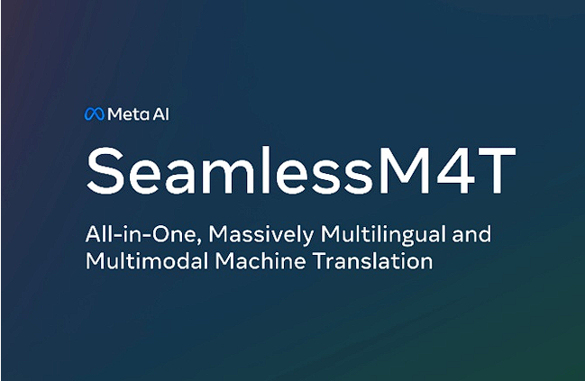

## Code Llama by Meta[^1]
Meta, the tech giant formerly known as Facebook, has entered the AI arena with Code Llama. This cutting-edge large language model (LLM) is tailored for coding tasks, capable of generating both code and natural language explanations related to code. With three models available in varying sizes, Code Llama is poised to meet the diverse needs of developers and programmers, making coding more efficient and accessible.

## AI2's Dolma Dataset [^2]
AI2 has made waves by releasing the colossal Dolma dataset, comprising a staggering 3 trillion tokens. What sets Dolma apart is its commitment to transparency. Unlike many other datasets, Dolma provides detailed insights into what information was removed, why it was removed, and how personal data was handled. This transparency underscores the ethical considerations surrounding data acquisition and usage in the AI community.

## SeamlessM4T by Meta [^3]
Meta is further extending its AI prowess with the development of SeamlessM4T, a foundational multimodal model for speech translation. A multimodal language model is an advanced artificial intelligence model designed to handle and generate content in multiple modes of communication simultaneously. These modes typically include text, images, and sometimes audio or other sensory data.  This powerhouse model can handle an extensive range of text and speech tasks across a staggering 100 languages. SeamlessM4T boasts features such as automatic speech recognition, speech-to-text translation, speech-to-speech translation, text-to-text translation, and text-to-speech translation. This innovation opens up new possibilities for seamless communication and understanding across language barriers.

## DeepLearning.AI Course on Finetuning Large Language Models [^4]
In a bid to empower AI professionals, DeepLearning.AI has launched a free course dedicated to "Finetuning Large Language Models." This course equips practitioners with the knowledge and skills needed to harness the potential of finetuning on LLMs. From data preparation to training and evaluation, the course covers the intricacies of customizing models, updating neural network weights, and enhancing results through style, form, and new knowledge incorporation.

## IDEFICS: An Open Reproduction of Visual Language Models [^5]
IDEFICS emerges as an impressive open-source visual language model with 9 billion and 80 billion parameters, drawing inspiration from DeepMind's Flamingo. This versatile model boasts the ability to describe images, generate narratives, and answer image-related questions. Trained on a diverse range of open datasets, including Wikipedia, Public Multimodal Dataset, LAION, and OBELICS, IDEFICS pushes the boundaries of visual AI.

## GPT-3.5 Turbo Fine-Tuning [^6]
OpenAI has unveiled a significant upgrade to its GPT-3.5 Turbo model by introducing fine-tuning. This enhancement promises improved performance on specific tasks, effectively rivaling the capabilities of the base GPT-4. Early testers have achieved remarkable results, reducing prompt size. Notably, the cost structure for training and usage input/output has been detailed at $0.008, $0.012, and $0.016 per 1K tokens, respectively. This advancement underlines the ever-increasing versatility and adaptability of AI models.

## Bing's Market Share Stagnation [^7]
Despite Microsoft's significant investments in AI-driven features like Bing AI Chat and Bing Image Creator, Bing's market share has remained largely stagnant at approximately 3%. While Microsoft disputes this data, experts question whether the missing interactions will significantly impact the overall landscape. This scenario highlights the challenges and competition in the search engine domain driven by AI.

[^1]: [Code Llama by Meta](https://ai.meta.com/blog/code-llama-large-language-model-coding/)

[^2]: [AI2's Dolma Dataset](https://techcrunch.com/2023/08/18/ai2-drops-biggest-open-dataset-yet-for-training-language-models/)

[^3]: [SeamlessM4T by Meta](https://ai.meta.com/blog/seamless-m4t/)

[^4]: [DeepLearning.AI Course on Finetuning Large Language Models](https://www.deeplearning.ai/short-courses/finetuning-large-language-models/)

[^5]: [IDEFICS: An Open Reproduction of Visual Language Models](https://huggingface.co/blog/idefics)

[^6]: [GPT-3.5 Turbo Fine-Tuning](https://openai.com/blog/gpt-3-5-turbo-fine-tuning-and-api-updates)

[^7]: [Bing's Market Share Stagnation](https://www.zdnet.com/article/bings-search-market-share-fails-to-budge-despite-ai-push/)