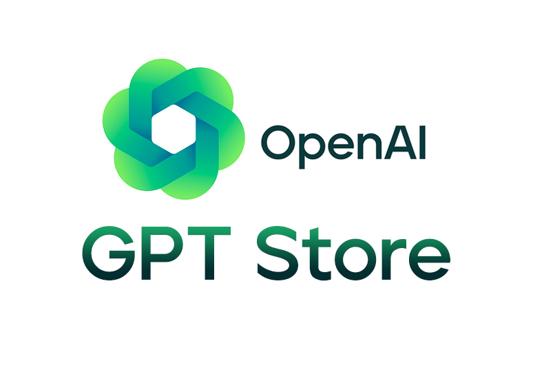
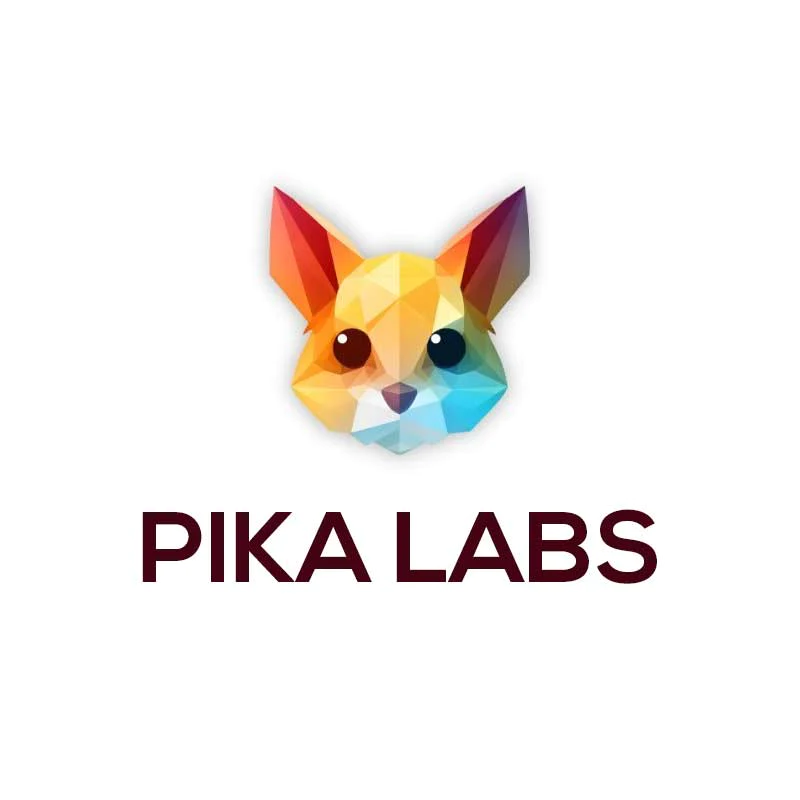
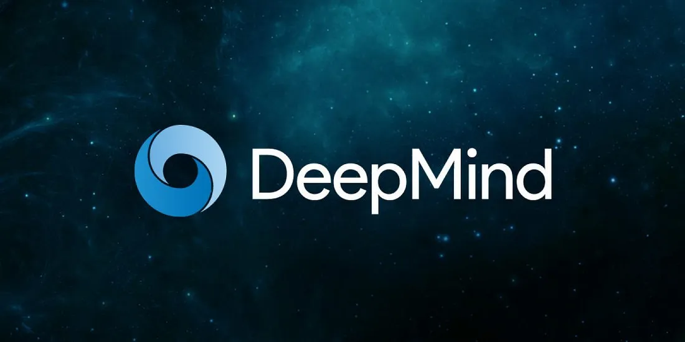

## This Month in AI - December 2023

As we bid farewell to another month, the AI landscape has witnessed a whirlwind of developments, from breakthroughs in AI capabilities to the announcement of significant partnerships and regulatory milestones. Here's a roundup of the most noteworthy news in the AI world for the past month.

<!--truncate-->

##  Divergence Attack Raises Privacy Concerns for ChatGPT: [^1]
A recent study sheds light on an unexpected vulnerability in language models, including ChatGPT. Researchers have identified a "divergence attack" that allows models to recall and regurgitate specific training data, potentially exposing sensitive information like email addresses and phone numbers. Privacy concerns loom as the AI community grapples with the implications of this discovery.

##  OpenAI's GPT Store Launch Postponed: [^2]
Anticipation for OpenAI's GPT Store will have to wait a bit longer as its launch gets postponed to the next year. The GPT Store aims to be a marketplace for users to share and sell their unique GPT creations, with OpenAI providing compensation based on usage. The delay suggests that OpenAI is diligently fine-tuning the platform for a seamless user experience.

##  Pika Labs Unleashes Pika 1.0: AI Video Generator Challenges Tech Giants: [^3]
Pika Labs makes waves in the AI scene with the release of Pika 1.0, an impressive video generation tool. Boasting advanced features like Text-to-Video and Image-to-Video conversion, Pika 1.0 has garnered attention and financial backing, securing a substantial $55 million in funding.

##  AI Alliance Takes Shape with IBM and Meta Collaboration: [^4]
In a move to foster collaboration and innovation in the AI space, IBM and Meta have joined forces to launch the AI Alliance. With over 50 founding members and collaborators, the alliance aims to promote AI projects, establish benchmarks, and ensure secure and beneficial AI development. Global AI skills building, research, and public education are among its key goals.

##  Elon Musk's X.AI Seeks $1 Billion in Funding: [^5]
Elon Musk's AI startup, X.AI, is making headlines as it files to raise a whopping $1 billion in fresh capital. Operating independently but collaborating with Musk's other ventures like Tesla and SpaceX, X.AI boasts a team of experienced professionals from renowned agencies, with projects like AlphaCode and GPT chatbots under their belt.

##  DeepMind AI Triumphs Over Human Mathematicians : [^6]
DeepMind's FunSearch AI achieves a milestone by outperforming human mathematicians in solving an unsolved problem related to combinatorics. Leveraging large language models, FunSearch showcases the power of AI in generating effective solutions and continually improving through testing and feedback.

##  Axel Springer and OpenAI Join Forces for AI in Journalism: [^7]
Axel Springer and OpenAI are set to deepen the beneficial use of AI in journalism through a strategic partnership. The collaboration aims to enhance ChatGPT with up-to-date news summaries from leading media outlets, providing transparent links to full articles. This partnership also supports Axel Springer’s AI projects relying on OpenAI’s cutting-edge technology.

https://www.axelspringer.com/en/ax-press-release/axel-springer-and-openai-partner-to-deepen-beneficial-use-of-ai-in-journalism

##  Europe Takes the Lead in AI Regulation: [^8]
Europe sets a historic precedent with the introduction of the AI Act, the first comprehensive pact to regulate AI. Addressing concerns of bias, privacy, and undue influence, the legislation covers all AI areas, including surveillance and critical infrastructure, with strict penalties for non-compliance. While some details need clarification, Europe's progress in setting transparency rules for generative AI developers signals a significant step forward.

https://finance.yahoo.com/news/europe-puts-stake-ground-first-104448975.html

Conclusion:
From groundbreaking advancements to regulatory milestones, the AI landscape has experienced a month filled with dynamic developments. As we eagerly await the unfolding of future endeavors, these recent events underscore the ever-evolving nature of artificial intelligence and its far-reaching impact on various facets of our lives.

[^1]: [chat Gpt ](https://stackdiary.com/chatgpts-training-data-can-be-exposed-via-a-divergence-attack/)

[^2]: [GPT Store ](https://www.theverge.com/2023/12/1/23984497/openai-gpt-store-delayed-ai-gpt)

[^3]: [pika labs ](https://decrypt.co/207799/pika-ai-video-tool-blasts-out-of-beta)

[^4]: [Ibm x Meta ](https://newsroom.ibm.com/AI-Alliance-Launches-as-an-International-Community-of-Leading-Technology-Developers,-Researchers,-and-Adopters-Collaborating-Together-to-Advance-Open,-Safe,-Responsible-AI)

[^5]: [X.AI ](https://www.cnbc.com/2023/12/05/elon-musks-ai-startup-xai-files-to-raise-1-billion-.html)

[^6]: [deepmind ](https://www.nature.com/articles/d41586-023-04043-w)

[^7]: [AI in journalism ](https://www.axelspringer.com/en/ax-press-release/axel-springer-and-openai-partner-to-deepen-beneficial-use-of-ai-in-journalism)

[^8]: [Europe takes lead ](https://finance.yahoo.com/news/europe-puts-stake-ground-first-104448975.html)