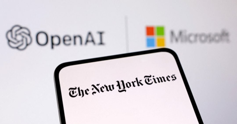
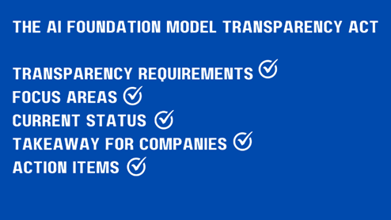

In the fast-paced world of technology, January 2024 unfolds with a myriad of groundbreaking developments. From the rise of AI-generated virtual influencers to legal battles shaping the future of journalism, this month's tech news is marked by innovation, controversy, and a glimpse into the transformative power of artificial intelligence.

<!--truncate-->

##  Virtual Influencers Redefine Marketing Dynamics Amid Ethical Concerns [^1]
   - AI-created virtual influencers, epitomized by the pink-haired Aitana Lopez, are reshaping the marketing landscape with controlled branding and predictability.
   - Despite their popularity, concerns about transparency and ethics loom large as they challenge traditional influencer models.

##  The New York Times' Legal Battle Against OpenAI and Microsoft [^2]
   - A high-stakes lawsuit unfolds as The New York Times accuses OpenAI and Microsoft of copyright infringement, claiming the unauthorized use of millions of articles.
   - The lawsuit raises crucial questions about the impact of AI models on high-quality journalism, highlighting the tension between innovation and intellectual property protection.

##  AI Foundation Model Transparency Act: A Paradigm Shift [^3]
   - A proposed bill aims to bring transparency to AI development, requiring companies to disclose copyrighted training data and address potential biases.
   - The bill emphasizes red teaming efforts to prevent the spread of inaccurate or harmful information in critical domains, marking a pivotal step in responsible AI development. 

##  Microsoft Revolutionizes Keyboards with Dedicated AI Button [^4]
   - In a historic move, Microsoft introduces a significant update to the traditional PC keyboard, featuring a dedicated AI button to activate the Copilot chatbot.
   - This innovation underscores Microsoft's commitment to embedding generative AI technology into their products, heralding a new era in human-computer interaction.

##  Camera Giants Combat AI Fakes with Signature Technology [^5]
   - Nikon, Sony, and Canon join forces to develop camera technology embedding tamper-resistant digital signatures in images.
   - This effort aims to distinguish authentic photos from sophisticated fakes, addressing the rising challenge of AI-generated content.

##  Cristiano Amon Envisions Rapid Integration of Generative AI [^6]
   - Qualcomm CEO Cristiano Amon anticipates the rapid integration of generative AI into mobiles, PCs, and cars.
   - Leveraging efficient AI processors, these advancements promise enriched user experiences through real-time AI applications on battery-operated devices.

##  OpenAI Launches GPT Store: Unveiling Diverse Applications [^7]
   - OpenAI pioneers the GPT Store, showcasing applications ranging from trail recommendations to academic research and coding education.
   - The move highlights the versatile applications of OpenAI's language models across various domains and industries.

##  AI Transforms Battery Technology: A Microsoft Breakthrough[^8]
   - Microsoft achieves a transformative breakthrough in battery technology using AI to screen over 32 million candidates.
   - The resulting new material could potentially reduce lithium requirements by 70%, addressing both economic and ethical concerns and showcasing the real and transformative potential of AI breakthroughs.

In this dynamic tech landscape, January 2024 stands as a month that propels the world into the next frontier of innovation and ethical considerations. In January 2024, AI-generated virtual influencers, exemplified by Aitana Lopez, are reshaping marketing despite ethical concerns. Legal battles, such as The New York Times' lawsuit against OpenAI and Microsoft, highlight the tension between AI innovation and intellectual property protection. The proposed AI Foundation Model Transparency Act seeks to bring accountability to AI development. Microsoft's introduction of a dedicated AI button on the PC keyboard signifies a commitment to seamless integration of generative AI into user experiences. Photography giants are combating AI-generated fakes with tamper-resistant digital signatures.

[^1]: [Virtual Influencers Redefine Marketing Dynamics Amid Ethical Concerns ](https://arstechnica.com/ai/2023/12/ai-created-virtual-influencers-are-stealing-business-from-humans/)

[^2]: [The New York Times' Legal Battle Against OpenAI and Microsoft ](https://www.theverge.com/2023/12/27/24016212/new-york-times-openai-microsoft-lawsuit-copyright-infringement)

[^3]: [AI Foundation Model Transparency Act: A Paradigm Shift ](https://www.theverge.com/2023/12/22/24012757/ai-foundation-model-transparency-act-bill-copyright-regulation)

[^4]: [Microsoft Revolutionizes Keyboards with Dedicated AI Button ](https://www.euronews.com/next/2024/01/04/microsoft-changes-keyboard-layout-for-the-first-time-in-nearly-three-decades-to-add-ai-but)

[^5]: [Camera Giants Combat AI Fakes with Signature Technology ](https://asia.nikkei.com/Business/Technology/Nikon-Sony-and-Canon-fight-AI-fakes-with-new-camera-tech)

[^6]: [Cristiano Amon Envisions Rapid Integration of Generative AI ](https://www.ft.com/content/dbc0984b-4801-4aeb-bcab-480704c34161)

[^7]: [OpenAI Launches GPT Store: Unveiling Diverse Applications ](https://openai.com/blog/introducing-the-gpt-store)

[^8]: [AI Transforms Battery Technology: A Microsoft Breakthrough ](https://www.independent.co.uk/tech/ai-batteries-material-lithium-microsoft-b2475763.html)