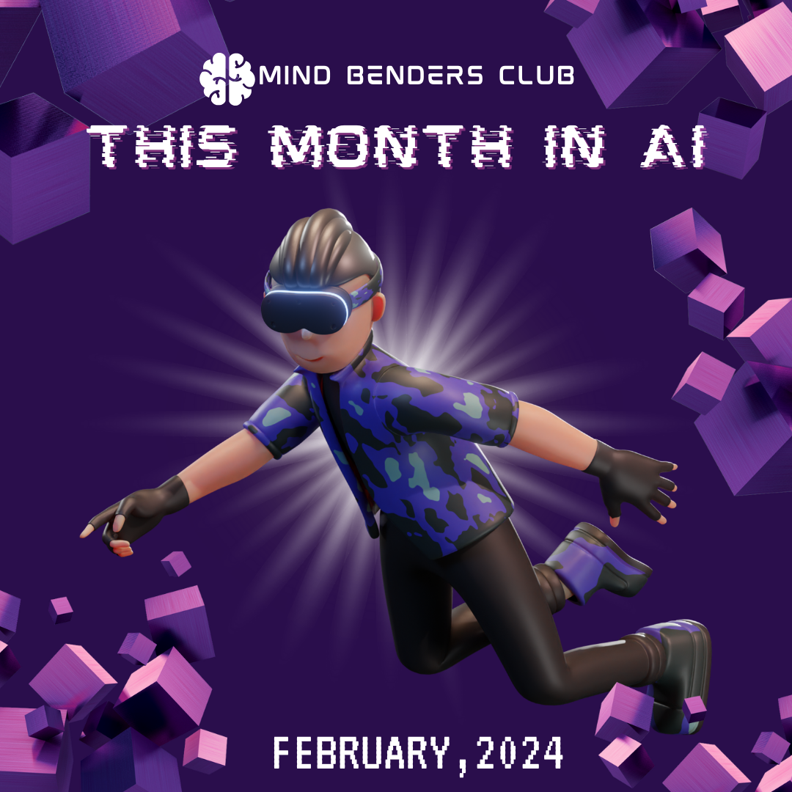
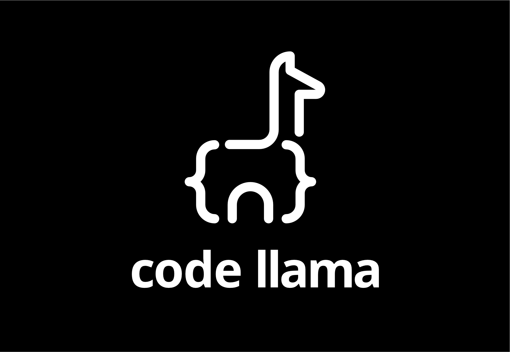
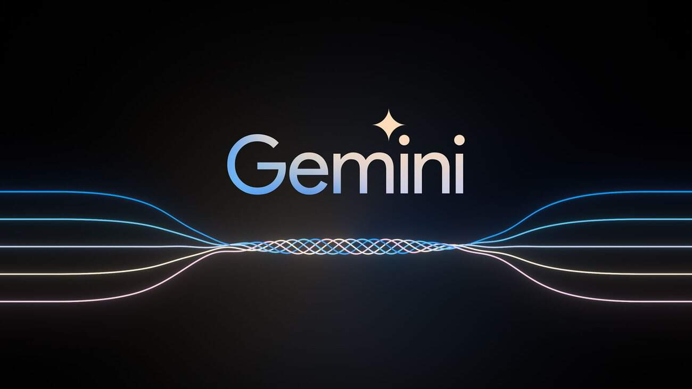
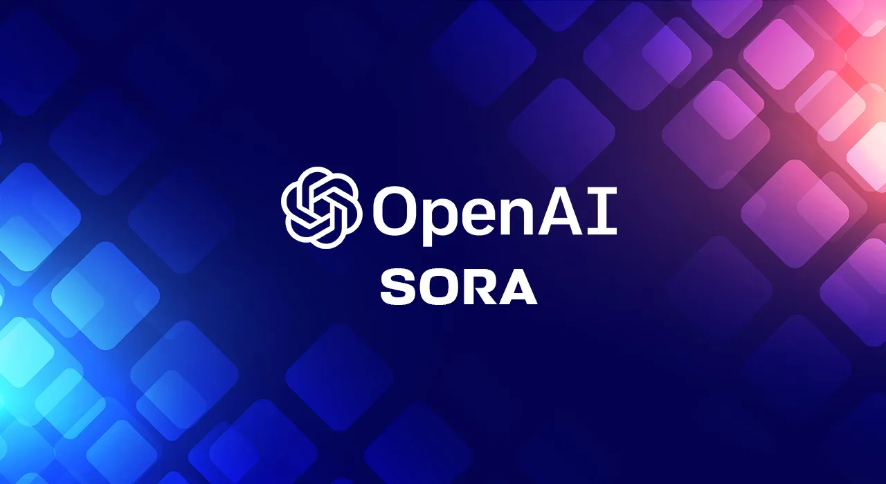
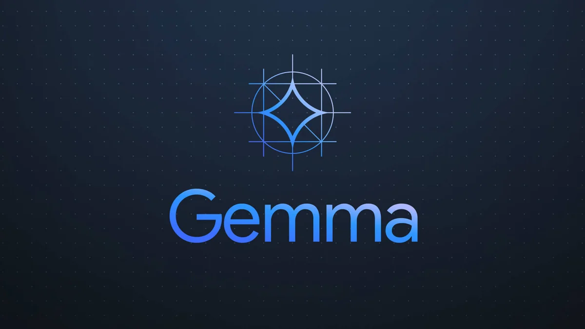
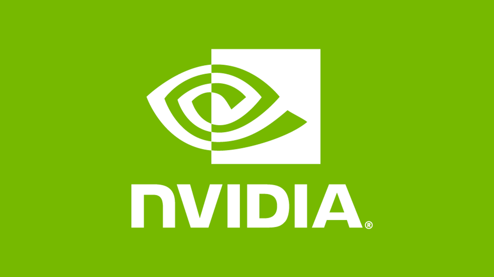

Unveiling the latest technological marvels, February 2024 stands witness to groundbreaking advancements in artificial intelligence (AI). From Meta's Code Llama to Google's Gemini Pro, the month showcases a flurry of innovations propelling the AI landscape into uncharted territories. Let

<!--truncate-->

## Code Llama Unleashed by Meta [^1] : 
   Meta's recent introduction of Code Llama 70B marks a significant leap in large language models for coding, offering three variants: the base model, a Python-specific version, and an 'Instruct' version for interpreting natural language commands. What sets it apart is its comparability to GPT-4, making strides in accessibility by providing all editions free for both research and commercial applications.

## Google's Gemini Pro Surpasses GPT-4 [^2] :
   In the fiercely competitive ChatBot Arena, Google's Gemini Pro has not only secured a position just below GPT-4 Turbo but has outshone GPT-4 itself, as per the eloquent rankings based on 200,000+ human votes. With speculations brewing about Meta's impending Llama 3 and the potential Q2 release of OpenAI's GPT-5, the AI sector is abuzz with anticipation and heightened competition.

## OpenAI Unveils Sora [^3] :
   OpenAI's unveiling of Sora introduces a groundbreaking AI video generator capable of translating textual prompts into minute-long videos. The demonstrations not only showcase its technical prowess but emphasize the seamless synergy between AI and human creativity, underscoring the potential for collaborative content creation.

## Stability AI Presents Stable Cascade [^4] :
   Stability AI's announcement of Stable Cascade, a research preview of a text-to-image model based on the innovative Würstchen architecture, is making waves. Distributed under a non-commercial license, Stable Cascade not only promises ease of training and fine-tuning on consumer-grade hardware but introduces a three-stage approach for enhanced performance, marking a noteworthy advancement in AI research.

## Yann LeCun Proposes V-JEPA for Advanced Machine Intelligence [^5] :
   Yann LeCun's proposal of V-JEPA introduces a novel machine learning paradigm aimed at imbuing systems with the ability to build internal world models and learn intuitively, echoing human cognitive processes. Departing from conventional methods, V-JEPA utilizes a non-generative technique for video understanding, prioritizing abstract interpretation over detailed reproduction.

## Google Releases Gemma [^6] :
   Google's recent release of Gemma, an open-source large language model derived from Gemini, comes in two versions with 2 billion (2B) and 7 billion (7B) parameters respectively. Beyond the basic pretrained models, Gemma offers instruction-tuned variants, showcasing Google's commitment to providing state-of-the-art language models catering to various linguistic tasks.

## Nvidia's Impressive Growth in Data Center GPU Sales [^7] :
   Nvidia's remarkable 409% surge in data center GPU sales is a testament to the escalating demand for AI technologies. With the Hopper GPU series, notably the H100, contributing significantly to robust Q4 earnings and revenue that surpass Wall Street forecasts, Nvidia is solidifying its position as a key player in the AI hardware landscape.

## Stability AI Introduces Stable Diffusion 3 [^8] :
   Stability AI's introduction of Stable Diffusion 3 for early preview brings notable enhancements, encompassing improved handling of multi-subject prompts, enhanced image quality, and heightened accuracy in visual text spelling. A select group of users now has the opportunity to test and refine the model, contributing to its refinement before general availability.

## Conclusion:
   The AI landscape is undergoing rapid evolution, as showcased by Meta, Google, OpenAI, and Nvidia. Exciting releases such as Code Llama, Gemini Pro, Sora, Gemma, and Stable Cascade demonstrate continual advancements in language models, video generation, and GPU technologies. Yann LeCun's V-JEPA introduces an innovative approach to machine learning paradigms. As we look ahead, the anticipation of Meta's Llama 3 and OpenAI's GPT-5 in the upcoming quarter adds an extra layer of competition and innovation in the AI sector. Stay tuned for more groundbreaking developments!

[^1]: [Source: Meta Blog](https://ai.meta.com/blog/code-llama-large-language-model-coding/)

[^2]: [Source: Analytics India Magazine](https://analyticsindiamag.com/googles-gemini-pro-beats-gpt-4/)

[^3]: [Source: OpenAI](https://openai.com/sora)

[^4]: [Source: Stability AI](https://stability.ai/news/introducing-stable-cascade)

[^5]: [Source: Meta AI Blog](https://ai.meta.com/blog/v-jepa-yann-lecun-ai-model-video-joint-embedding-predictive-architecture/)

[^6]: [Source: Google AI](https://ai.google.dev/gemma/)

[^7]: [Source: Silicon Angle](https://siliconangle.com/2024/02/21/nvidias-data-center-gpu-sales-grow-stunning-409-huge-demand-ai-chips/)

[^8]: [Source: Stability AI](https://stability.ai/news/stable-diffusion-3)
