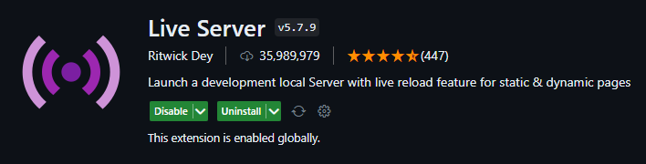

:::info 
The TCET Training and Placment page is built using **JavaScript**, which allows for dynamic interaction with web pages, enabling developers to create responsive and interactive user interfaces.
:::

## Steps to run the site on your local system: 
These are the steps you need to follow to get this site on your local system.

### 1.  Install Git in your computer
Follow these steps to install git in your computer.
1. Go to **[https://git-scm.com/downloads](https://git-scm.com/downloads)**.
2. Click on Windows. Download should start.
3. Go to downloads and install the package.

### 2. Clone the repo
Open Git Bash in any folder and paste the following command

```bash
git clone https://github.com/tcet-opensource/fillmycycle
```

### 3. Install NodeJS

1. Go to **[https://nodejs.org/en/download](https://nodejs.org/en/download)**
2. Select <b>Current</b>.
3. Download the 64-bit .msi version. Follow the steps and install NodeJS.

:::note
It is important to have NodeJS in your system
:::

### 4. Open the folder in VS Code
1. Install **[VS Code](https://code.visualstudio.com/docs/?dv=win32user)** if not installed. 
2. Open Windows Terminal in the folder you have cloned the repo, as done in [step 2](#clone-the-repo).

### 5. Required Extensions

1. Inorder to run html and JavaScript files on VS code and to preview the code, we are reqiured to download some extensions.
2. To install extensions you are required to open **extensions icon** present on left sidebar.
3. Now search here ***Live Server*** and install the extension with placed right at top.

    > 

4. Do the same procedure and install ***Code Runner***(to preview JavaScript).

    > 

### 6. To Preview

1. On opening the `index.html` file we can simply by right clicking on a HTML file from Explorer Window and **clicking on Open with Live server** or open a HTML file and ***right-click*** on the editor and click on **Open with Live Server** or can even use a shortcut **alt+L.**

2. For previewing the `script.js` file we can easily press **Run Code** or **ALt+Ctrl+N**, but this can only we used to show outputs, but in our case we also deal with inputs from the user.

3. So to resolve this issue we'll first open terminal and put the following command and hit enter.

    ```bash
    npm install prompt-sync
    ```

4. Now we are all set to go, on running the code we'll get the preview as well the input promt in **Terminal**.


_**Following the above steps we have successfully run and examined the preview as well.**_