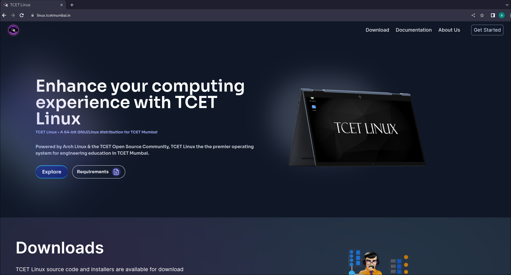

TCET Linux Installation `element` is a step-by-step guide created by us that will walk you through the process of installing [**TCET Linux**](https://github.com/tcet-opensource/tcet-linux/releases/download/v0.5-beta/checksum) using a bootable pendrive on your system.This `Section` in the [**TCET Linux Website**](https://linux.tcetmumbai.in/) helps the user to easily install `TCET Linux` on their Device.

### Step 1. Download the latest version of TCET LINUX

Download the latest version from our [**official website**](https://www.tcetlinux.com/downloads) .

<!--  -->
<!-- Above image routing is incorrect, refer the route below and update all image routes -->

### Step 2. Prepare the Bootable USB Stick

- You need to create a bootable USB stick from which you will install your new operating system. You can use various tools for this purpose such as Rufus.

<!--  -->

- Firstly, you need to download and install [**Rufus software**](https://rufus.ie/) into your Windows PC.
  <!--  -->

- Then open Rufus in your device and you will get a prompt (saying do you want to allow this application to make changes to your device), click on **YES** .
- A Rufus window will open .
  <!--  -->

- Here, under device you will able to see the drive or usb device that you have plugged in your device port.
- Note that you have selected Disk or ISO image under the Boot selection option.
- Then click on `SELECT` and then you want to locate your ISO which is probably going to be inside the downloads folder. Double click on it and as you can see that tcet linux ISO file has been selected.
- You want to make sure the partition scheme for the bootable usb is MBR and this will work on both BIOS and UEFI systems.
- Now keeping everything else as default setting , the next thing we will do is go ahead and click on start.
  <!--  -->

- Now after this there will be a menu box opened which will ask you whether you want to write an ISO image or write the same thing in DD mmode. Choose DD mode for writing the ISO image. This is recommended because some distributions may encounter issues booting in UEFI/BIOS mode with the default option.
  <!--  -->

- Now click on OK and a pop up menu will openn which will warn you that all the data on the usb device is going to be wipped off, so this is where you want to make sure that you have already backed up all the data.
  <!--  -->

:::
Make sure you select the correct drive where you want to create the bootable installer.

:::
make sure you have backed up the data in the usb in other device, as once click `READY` the data is going to be wipped off.

### Step 3.

- Now insert the USB stick back into your computer and restart it.
- The BIOS menu should appear with all available drives listed for installation. Select TCET Linux.
- If you can't then restart and press esc button before the Windows OS load.
- This time you should be able to see the USB drive being detected by the system.
- Move up until you get to "Boot Options" (Usually F9 or F10). Press Enter.
- You'll now see an entry called "TCET Linux". Highlight this item and hit enter again.
- Your screen may freeze at this point but don’t worry! Just wait about 5 minutes and you should reach the login page.

_After successfully implementing the **[in-drive-installation](installation-in-drive)** of **[TCET Linux](https://linux.tcetmumbai.in/)**, we were ready with a bootable drive. Next, we will be seeing how we can install it using virtual machine ._
