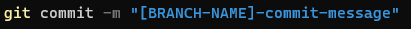

# EXTERNAL WORKFLOW FOR GITHUB
Third party contributions on GitHub follow a particular series of steps that need to be followed and known well enough especially when you are contributing to a repository for the first time and are not declared as a contributor already.

*Pre-requisites*
You obviously need to have Git installed on your device in order to use the Git commands in the terminal. An IDE, VS-Code being the best recommendation, must also be installed.

Listed below are the sequential steps you need to know so as to make your contribution :-

## Forking the repository
As an outside contributor, you do not have an access to the repository and so you need to have a copy of the same on your local system in order to make changes. There is no git command required for this particular action, as the GitHub interface itself provides a "Fork" tab in the top right of the repository page as shown below. 

## Cloning
The next step involves cloning the system to your local repository. In the terminal, use the command "git clone" and paste the URL of the repository page you are looking forward to make changes in.

## Making changes
- Now that you've a copy of the entire folder on your local system, you can easily make changes in it.
- Branching plays an important role here. The branch name should be informative and to-the-point when creating a new branch. The issue name should be the branch name itself.
- If you are supposed to be working with an existing branch, make sure that the issue name is crisp and gives an idea of what you have added or changed.
- Use "git add" command to add a single file and "git add ." to add all the files.

## Commit your changes
- In order to showcase the changes you made to the local repository over onto the main repository, committing the change is mandatory.
- The syntax goes like : git commit -m "*commit message*"
- Note that the commit message should be a short one-liner description of the changes you made or added.

## Git Pull
Use the "git pull origin develop" command to bring all the changes in the main repository to your local repository so as to avoid any obsolete code.
It is advisable to always pull before pushing your changes.

## Resolve conflicts and Push
- In case of any merge conflicts, feel free to contact the team lead to resolve them.
- Create a push request, 

