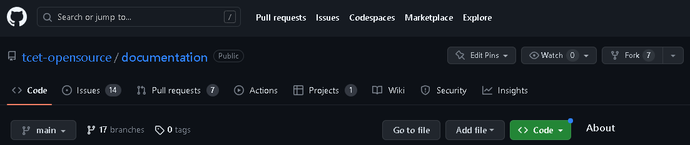
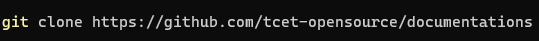
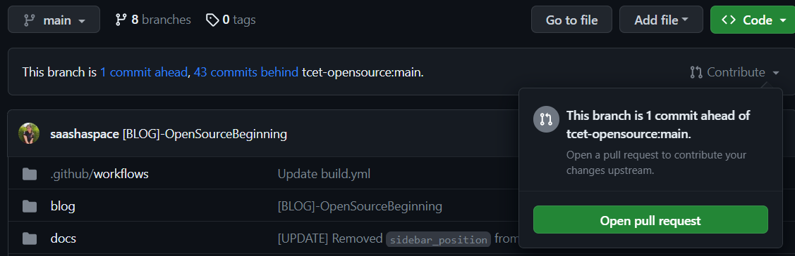
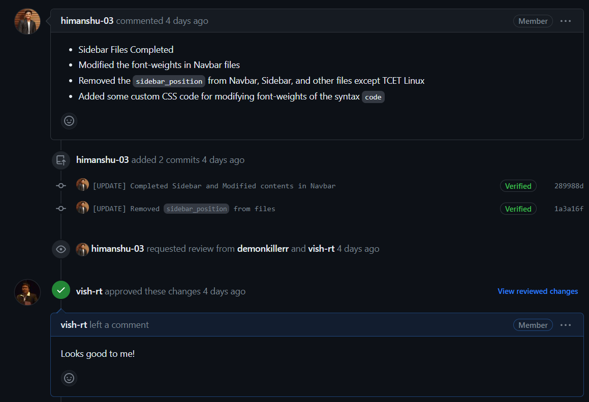

This document discusses the Git workflow for the contributors outside the Organization. All contributors are requested to be thorough with this workflow in order to keep up with the fast paced developement/production life cycle of our software.

## Pre-requisites
You need to have Git installed on your device in order to use the Git commands in the terminal. Visit [GitHub's documentation](https://docs.github.com/en/get-started/quickstart/set-up-git#setting-up-git) to set-up Git on your device.

As an IDE, Visual Studio Code being the best recommendation, must also be installed.

## Raising issues
Issues are the standard way to for communication between maintainers, contributors and end users on GitHub. They can be raised by anyone highlighting **task allocation**, **bug reports**, **feature request**, **security vulnerablity**, etc.

If you wish to contribute to a specific part of the project, `raise an issue` and request the maintainers to assign it to you. This is where your work within the project begins.

## Forking the repository
As an outside contributor, you do not have an access to directly push changes to our repositories. Hence you need to have a copy of the same repository on your account in order to work on the project.

:::info Note

There is no Git command required for this particular action, as the GitHub interface itself provides a **Fork** tab in the top right of the repository page as shown below. 



Upon creating a fork, a copy of the repository will be available on your GitHub account.

:::

## Working on your repository
### Cloning the repository
The next step involves cloning the system to your local repository. In the terminal, use the command `git clone` and paste your repository's URL to make changes in the project.



The clone command would look like the following. Note that your repository's URL would have your account's name in it.
```
git clone <your repository url>
```

### Keeping your repository and local up-to-date
- While you are working on your project, several versions of code are scattered within the main repository in the Organization. You need to make sure that you always have the updated code before pushing to GitHub to avoid **merge conflicts**.
- Before starting to work on your code, you must ensure that your repository is up-to-date with the main repository.

:::info 

- Referring the above screenshot, the forked repository is not up-to-date with the repository.
- If your repository is *n commits behind main*, you need to click on `Sync Fork` to fetch the changes from main repository to yours.
- To bring these changes in your local, use the following command:
```
git pull
```

:::

It is a good developer practice to always pull updated code before pushing your modified code to the repository.

### Reflecting your changes on GitHub

At any given time, you can check the status of your modifications on the local:
```
git status
```

#### Staging Area
- Staging Area in Git is is the middle ground between what you have done to your files and what was last committed in the repository.
- Before reflecting your changes on GitHub, all files are needed to be added to this staging area.
- To add files to staging area, use the following command:
```
git add index.html
```
- This adds `index.html` to the staging area. If you want to add all files, use `git add .`

### Commits and Pushes
- GitHub is a version control tool. To track all past versions, GitHub uses `commits` made by contributors to show changes made to the files.
- To reflect your local changes on GitHub, they need to be committed first with the following command:
```
git commit -m "<your commit message>"
```
- You must ensure that `<your commit message>` is a valid explanation of the changes you have made to the files.

Finally, once all of the above are done, push your changes to GitHub:
```
git push
```

## Creating a Pull Request
As you keep pushing changes on your repository, GitHub will start adding the number of commits you are ahead of main. To reflect these changes in the Organization, you need to create a **Pull Request** upon pushing all the changes done on your local by clicking on `Contribute`.



By following the above step, you will be able to edit the PR on GitHub's editor.

:::info Writing good Pull Requests

- Your pull request title should suggest what changes you have done in your repository.
- The title should start with a prefix within square brackets. It can reflect `[FEATURE]`, `[FIX]`, `[MINOR]`, `[MAJOR]`, `[PAGE]`, `[DEPLOYMENT]`, etc.
- As a good developer practice, you should elaboratively describe what changes you have made to the code and highlight them in the description.

:::

- Upon submitting the pull request, the administrator is notified of your changes and can **approve**, **reject** or **request changes** to your pull request.
- You can also notify repository maintainers and engage conversations with them on the pull request. An example of such conversation can be observed here:



## The Next Steps
If the maintainer requests changes in your pull request, you can add further commits on the pull request and *mark the changes as resolved* for further approval from the maintainer.

Once a maintainer approves your changes, then finally your pull request will be merged to the Organization repository.

This is the entire developer cycle for a contributor working from outside the Organization. Every time a maintainer approves your issue, you should follow the same make meaningful contributions to our projects.