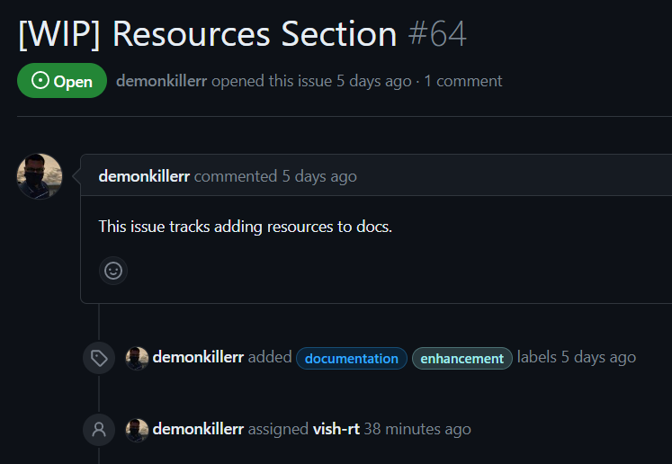
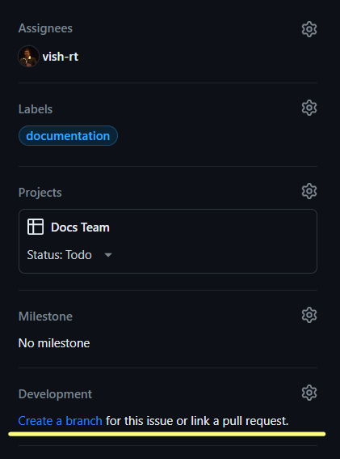
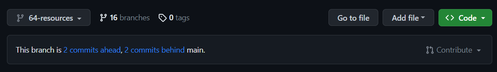
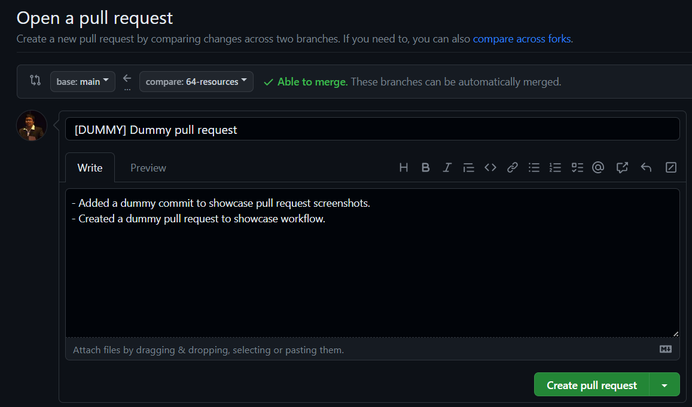

This document discusses the Git workflow for members of the Organization. All members are requested to be thorough with this workflow in order to keep up with the fast paced developement/production life cycle of our software.

## GitHub Pre-requisites
Assuming you already are a part of the Organization, you might not need to do this. But if you don't have Git set-up on your local system, visit [GitHub's documentation](https://docs.github.com/en/get-started/quickstart/set-up-git#setting-up-git) to set-up everything before beginning work in the projects.

## Understanding Issues
Issues are the standard way to for communication between maintainers, contributors and end users on GitHub. They can be raised by anyone highlighting **task allocation**, **bug reports**, **feature request**, **security vulnerablity**, etc. Team Leads are responsible to assign an issue to you. This is where your work within the project begins.

## Branches - Your personal workspace
Let's say your Team Lead has assigned you an issue. It would look something like this:



Comments within an issue can be used by the Team Lead to explain to you the task assigned and how to approach it. Your issue may also contain labels to highlight what kind of work you'll be doing and what's the expectations of the end user.

To work on the task assigned to you, the very first thing you need to do is to **Create a Branch** which is *linked to your issue*. It is necessary to do so in order to link your work to the issue. You can do this within the issue itself.



:::info Important

Naming your branch must be according to the following guidelines:
- The branch name must **always** start with issue number. It is always written beside the issue title (ex: #64).
- The branch name should not be too big and highlight the purpose of the branch.
- For the above screenshot attached, the branch name would be `64-resources` or something similar.

:::

## Working on your branch
Upon creating the branch, the very first thing you need is that branch's contents within your local system.

### Cloning the repository
You must always ensure that you are working on your branch in the repository. Branches are a great way to get the privacy in the codespace to make your changes *without affecting the main project code*. This ensures that you can experiment as much as you want without harming the project at all.

While cloning the project, you should specify the branch which you will be working on in your local using `-b` command. Your clone command would look similar to the following:
```
git clone -b <your-branch-name> <repository-url>
```
Now you can work on the project on your local repository.

### Keeping your branch and local up-to-date
- Now that you have your branch and several versions of code scattered around GitHub and your local storage. You need to make sure that you always have the updated code before pushing to GitHub to avoid **merge conflicts**.
- Before starting to work on your code, you must ensure that your branch is up-to-date with the `main` branch.

- If your branch is *n commits behind main*, you need to open a pull request to merge `main` branch content to your branch.
- To bring these changes in your local, use the following command:
```
git pull
```

It is a good developer practice to always pull updated code before pushing your modified code to the repository.

### Reflecting your changes on GitHub

At any given time, you can check the status of your modifications on the local:
```
git status
```

#### Staging Area
- Staging Area in Git is is the middle ground between what you have done to your files and what was last committed in the repository.
- Before reflecting your changes on GitHub, all files are needed to be added to this staging area.
- To add files to staging area, use the following command:
```
git add index.html
```
- This adds `index.html` to the staging area. If you want to add all files, use `git add .`

### Commits and Pushes
- GitHub is a version control tool. To track all past versions, GitHub uses `commits` made by contributors to show changes made to the files.
- To reflect your local changes on GitHub, they need to be committed first with the following command:
```
git commit -m "<your commit message>"
```
- You must ensure that `<your commit message>` is a valid explanation of the changes you have made to the files.

Finally, once all of the above are done, push your changes to GitHub:
```
git push origin <your-branch-name>
```

## Creating a Pull Request
- In all projects under TCET Open Source, the `main` branch is locked by the repository admin to ensure that no outside contributor directly edits the main source code of the project.
- Upon pushing to your branch, you would be able to see updates on GitHub:


- You can click on `Compare and Pull Request` (or alternatively, visit your branch and click on `Contribute`) to **create a Pull Request**.

By following the above step, you will be able to edit the PR on GitHub's editor.

:::info Writing good Pull Requests

- The `main` branch is only merged into by your Team Lead. You should push to `staging` or any other branch decided by the Team to work on.
- Your pull request title should suggest what changes you have done in your branch.
- The title should start with a prefix within square brackets. It can reflect `[FEATURE]`, `[FIX]`, `[MINOR]`, `[MAJOR]`, `[PAGE]`, `[DEPLOYMENT]`, etc.
- As a good developer practice, you should elaboratively describe what changes you have made to the code and highlight them in the description.

:::



- Upon submitting the pull request, the administrator is notified of your changes and can **approve**, **reject** or **request changes** to your pull request.
- You can also notify repository maintainers and engage conversations with them on the pull request. An example of such conversation can be observed here:


## The Next Steps
If the maintainer requests changes in your pull request, you can add further commits on the pull request and *mark the changes as resolved* for further approval from the maintainer.

Once a maintainer approves your changes, then finally your pull request will be merged to the `main` branch.

This is the entire developer cycle for a team member contributing within the Organization. Every time a new issue is raised, you should follow the same to work with the rest of the team efficiently.